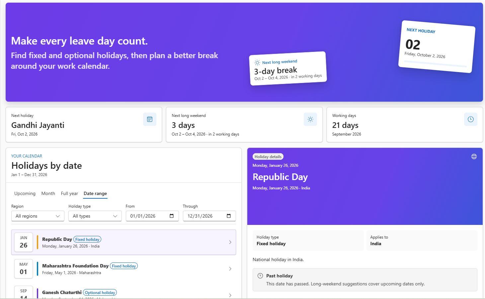
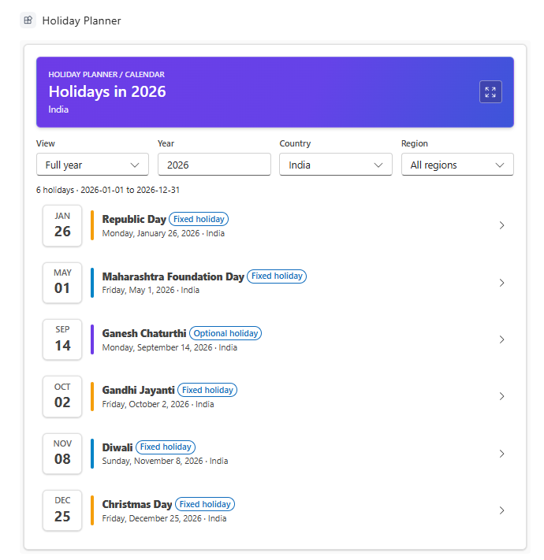
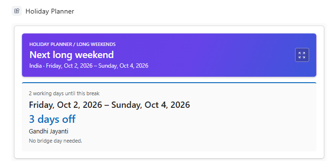

# Holiday Planner - Working Days, Long Weekends , Holiday Calendar in Copilot Chat

## Summary

**Holiday Planner** is a set of five SPFx **Copilot Components** that answer holiday-planning questions directly in Microsoft Copilot. A single declarative agent routes each request to the matching tool, which renders a live React card in the conversation: an inclusive working-day count, the next long weekend with bridge-day suggestions, a full-year or upcoming holiday list, a working-day check for a specific date, or a side-by-side comparison of office calendars.

Expanding a card opens the shared **Holiday Planner dashboard** with a hero summary, calendar tabs (Upcoming, Month, Full year, Date range), holiday details, and a Vacation Optimizer that shows how many days off each number of leave days can buy. Holiday data comes from a SharePoint list under the signed-in user's delegated identity. It is a fixed-calendar planning tool, not a leave-request or balance experience.





| Component | Copilot tool | Primary answer |
|---|---|---|
| Working Day Calculator | `CalculateWorkingDays` | Inclusive working-day count and exclusion breakdown |
| Long Weekend Finder | `FindLongWeekends` | Next holiday-backed extended break, working days until it, and bridge-day suggestions |
| Upcoming Holidays | `GetUpcomingHolidays` | Full-year, month, or date-range holiday lists; next-holiday countdown for upcoming requests |
| Holiday Details | `GetHolidayDetails` | Working-day status or details for a named holiday |
| Regional Comparison | `CompareRegionalHolidays` | Shared dates, unique dates, and working-day mismatches across locations |

## Compatibility


## Applies to

- [SharePoint Framework](https://learn.microsoft.com/sharepoint/dev/spfx/sharepoint-framework-overview) 1.24+ (Copilot Component)
- [Microsoft Copilot extensibility](https://learn.microsoft.com/microsoft-365-copilot/extensibility/)
- [Microsoft 365 tenant](https://learn.microsoft.com/sharepoint/dev/spfx/set-up-your-development-environment) with the SharePoint App Catalog

> Get your own free development tenant by subscribing to the [Microsoft 365 Developer Program](https://aka.ms/m365/devprogram).

## Contributors

- [Harminder Singh](https://github.com/HarminderSethi)

## Version history

| Version | Date | Comments |
| ------- | ---- | -------- |
| 1.0.0 | 2026-09-30 | Initial release |

## Prerequisites

- Node.js `>=22.14.0 <23.0.0`
- SharePoint Online and Microsoft 365 Copilot enabled in the tenant
- Permission to deploy to the SharePoint App Catalog and approve API permissions
- [PnP.PowerShell](https://pnp.github.io/powershell/) for list provisioning

The solution requests the following delegated Microsoft Graph permissions, declared in [`config/package-solution.json`](./config/package-solution.json). A tenant administrator must approve them in **SharePoint admin center > Advanced > API access** after deployment.

| Permission | Why it is needed |
| ---------- | ---------------- |
| `User.Read` | Reads only the `country` property of the signed-in user's profile to choose a default calendar when no query country or saved preference exists. |
| `Files.ReadWrite.AppFolder` | Stores the user's chosen default country in a small JSON file in their OneDrive app folder. No broad `Files.ReadWrite.All` access is requested. |

Holiday data itself is read from the `OrganizationHolidays` SharePoint list with SharePoint REST under the signed-in user's identity. The components never use app-only credentials and never modify holiday records.

## Minimal path to awesome

- Clone this repository
- From your command line, change your current directory to this solution's root
- Install the dependencies:

```bash
npm install
```

- Start the hosted tenant workbench:

```bash
npm run start
```

SPFx Copilot Components cannot be tested in the local workbench. Use the hosted Copilot Workbench in a tenant where the solution is deployed (see [Debug in Copilot Workbench](#debug-in-copilot-workbench)).

- To create the production package, run:

```bash
npm run build
```

Deploy `sharepoint/solution/holiday-planner.sppkg` to the SharePoint App Catalog and `teams/holiday-planner.zip` to the Teams/Copilot app catalog, approve the API permissions, then configure the tenant property and provision the list as described next. Start a new Copilot conversation after every redeploy so the agent picks up the latest tool schema and instructions.

### Configure the holiday site

The components read the tenant-scoped SharePoint storage entity `HolidayPlannerSite` once per session. Set it to the absolute URL of the site that hosts the holiday list:

```powershell
Set-PnPStorageEntity `
  -Key HolidayPlannerSite `
  -Value "https://contoso.sharepoint.com/sites/hr" `
  -Description "Site hosting the Holiday Planner lists"
```

Changing the property requires no rebuild or redeploy. If it is unset, the current SharePoint site context is used. If the site or list is unreachable, the components show the bundled India/UK demo dataset and label it as demo data.

### Provision the list

```powershell
cd scripts
Install-Module PnP.PowerShell -Scope CurrentUser
Register-PnPEntraIDAppForInteractiveLogin -ApplicationName "PnP Holiday Planner" -Tenant contoso.onmicrosoft.com
./Provision-HolidayLists.ps1 `
  -SiteUrl "https://contoso.sharepoint.com/sites/hr" `
  -ClientId "00000000-0000-0000-0000-000000000000" `
  -SeedSampleData
```

`-ClientId` is required for PnP.PowerShell 2.2 and later. See [`scripts/README.md`](./scripts/README.md) for parameters, list fields, and destructive-operation details.

`OrganizationHolidays` is read by every component. Field internal names are `HolidayDate`, `Country`, `Region`, `IsOptional`, and `Description`. `IsOptional` is the sole classification field: Yes means Optional and No means Fixed. Users need read access to the list.

### Try it in Copilot

- "How many working days are left this month?"
- "What is the next long weekend?"
- "What holidays are coming up?"
- "Is next Monday a working day?"
- "Show all holidays this year."
- "Show all holidays in 2026 for India"
- "Compare upcoming holidays across our office locations."

## Features

This sample illustrates the following concepts:

- **Five single-purpose Copilot Components under one declarative agent** - Each tool has its own manifest GUID, Zod-based properties schema, and inline card, so routing stays unambiguous; expanding any dashboard-backed tool opens one shared dashboard.
- **Card-first agent instructions** - `copilot/instruction.txt` treats the rendered component as the primary answer and constrains the agent to a single lead-in sentence with no positional or "information unavailable" language, because Copilot UX tools return no text payload to the model.
- **Tenant-property configuration** - The `HolidayPlannerSite` storage entity lets an administrator repoint the data source without rebuilding, following the `time-off-absence` pattern.
- **Delegated-only data access with resilient fallback** - SharePoint REST and Microsoft Graph run in the browser as the signed-in user. Data services never throw; demo data renders when live data is unavailable and is labelled as such.
- **Country resolution chain and OneDrive preference** - Explicit query country, then a saved OneDrive app-folder preference, then profile country, then browser locale region, then a recognised time zone, then Global. Saving a default is an explicit user action in the dashboard.
- **Regional comparison that survives expansion** - The side-by-side table, shared and unique counts, and working-day mismatches remain when the card is expanded.


### Debug in Copilot Workbench

In PowerShell, set the tenant domain used by `config/serve.json`, trust the local HTTPS certificate, and start the Heft dev server:

```powershell
$env:SPFX_SERVE_TENANT_DOMAIN = "contoso.sharepoint.com"
npx heft trust-dev-cert
npx heft start --nobrowser
```

Open `https://contoso.sharepoint.com/_layouts/15/copilotworkbench.aspx` and accept the prompt to load debug manifests. Select a Holiday Planner component, enter its properties JSON (all properties are optional, so `{}` is valid), then select **Fire turn**. The component is not instantiated until a turn is fired.

In browser developer tools, inspect Network requests for `GetStorageEntity` and `OrganizationHolidays`. If requests fail, the component falls back to demo data and logs the SharePoint failure in the console. Heft manages webpack by default; run `npm run eject-webpack` only if you need a custom webpack configuration.

### Scope boundary

Holiday Planner has no leave-plan builder, balances, entitlements, accruals, leave requests, or manager views.

## Help

If you encounter issues using this solution, please [open an issue](https://github.com/pnp/spfx-copilot-components/issues) in the repository.

## Disclaimer

**THIS CODE IS PROVIDED _AS IS_ WITHOUT WARRANTY OF ANY KIND, EITHER EXPRESS OR IMPLIED, INCLUDING ANY IMPLIED WARRANTIES OF FITNESS FOR A PARTICULAR PURPOSE, MERCHANTABILITY, OR NON-INFRINGEMENT.**


