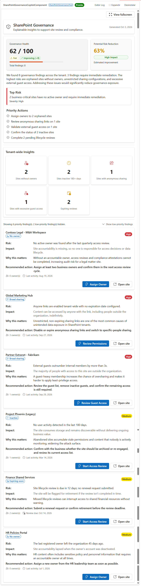

# Governance Risk Advisor — Explainable Governance Insights for Microsoft 365 Copilot


## Summary

**Governance Risk Advisor** is an SPFx 1.24 **Copilot Component** that turns a sprawling SharePoint tenant into a single, explainable governance briefing instead of a flat risk list. Rather than dumping a table of findings on the user, it opens with a **governance score**, an **AI-style executive summary**, and a **prioritized action list** — then lets the user drill into every finding with its business impact, why it matters, and a one-click remediation prompt back into Copilot.

The component is built for the people who actually act on governance data: Governance Managers, Compliance Officers, CIOs, and SharePoint Administrators — not just developers.



## Why this sample matters
 
Many governance solutions focus on reporting findings.
 
This sample demonstrates how Microsoft 365 Copilot and SPFx Copilot Components can transform governance data into actionable recommendations by combining executive summaries, explainable findings, prioritized actions, and remediation workflows directly inside the Copilot canvas.

## Sample prompts

### Executive governance review

Analyze the tenant and prioritize the top governance risks that require immediate remediation.

### Ownership review

Show me sites that don't have active owners and explain the governance impact.

### External sharing review

Identify sites with excessive guest access or anonymous sharing links.

### Lifecycle management

Show inactive sites that should be archived or reviewed.

### Compliance posture

Generate an executive governance briefing for the tenant.

## Compatibility

> Don't worry if you're unsure about the compatibility details above. We'll verify them when we review your pull request.

## Applies to

- [SharePoint Framework](https://learn.microsoft.com/sharepoint/dev/spfx/sharepoint-framework-overview) 1.24+ (Copilot Component)
- [Microsoft Copilot extensibility](https://learn.microsoft.com/microsoft-365-copilot/extensibility/)
- [Microsoft 365 tenant](https://learn.microsoft.com/sharepoint/dev/spfx/set-up-your-development-environment) with the SharePoint App Catalog

> Get your own free development tenant by subscribing to the [Microsoft 365 developer program](https://aka.ms/m365/devprogram)

## Contributors

- [Maycon de Novaes Batista](https://github.com/mnbatista) 
## Version history

| Version | Date              | Comments        |
| ------- | ----------------- | --------------- |
| 1.0     | October 3, 2026   | Initial release |

## Prerequisites

- Node.js >=22.14.0 <23.0.0
- [Heft](https://heft.rushstack.io/) (`npm install -g @rushstack/heft`)
- No live Microsoft Graph permissions or app registrations are required — this sample runs entirely on mock data behind a swappable `IGovernanceService` interface.

## Minimal path to awesome

- Clone this repository (or [download this solution as a .ZIP file](https://pnp.github.io/download-partial/?url=https://github.com/pnp/spfx-copilot-components/tree/main/samples/sharepoint-governance-copilot) then unzip it)
- From your command line, change your current directory to `samples/sharepoint-governance-copilot`
- In the command line run:
  - `npm install -g @rushstack/heft`
  - `npm install`
  - `npm start` — starts the local dev server (`https://localhost:4321`)
- Invoke the agent in Microsoft Copilot and confirm the governance score, executive summary, priority actions, tenant insights panel, and the expand-to-fullscreen affordance.

Production build, test, and package:

```bash
npm run build
```

Other build commands can be listed using `heft --help`.

## Features

Governance Risk Advisor demonstrates how to turn raw governance findings into an executive-level, action-oriented experience inside the Microsoft Copilot canvas using an SPFx Copilot Component.

This sample illustrates the following concepts:

- **Copilot Component UX** — a `CopilotComponent` (`copilotType: "Ux"`) surfaced as a tool a declarative agent can call, rendering its own React UI inside the Copilot host.
- **Governance score with trend** — a 0-100 tenant governance score, derived from the severity mix of all findings, with an Improving / Stable / Declining indicator compared against a prior-period baseline.
- **AI-style executive summary** — a narrative paragraph (deterministically generated from the data, no live LLM call) that tells the governance story in one breath: how many findings, how many need immediate attention, and what the highest risks are.
- **Prioritized actions, not a flat list** — the top 3-5 remediation actions are generated by grouping findings by category and ranking them by severity-weighted impact (for example, "Assign owners to 2 orphaned sites").
- **Severity-first findings with progressive disclosure** — high and medium findings are always shown; low-priority findings are collapsed behind a "Show N low-priority findings" toggle.
- **Explainability for every finding** — each finding states the **Risk**, **Impact**, **Why this matters**, and **Recommended action** in business language, not technical jargon.
- **Remediation call-to-action** — every finding has a primary action button (for example *Assign Owner*, *Review Permissions*, *Review Guest Access*, *Start Access Review*) that sends a follow-up message back into the Copilot conversation via `bridge.sendFollowUpMessageAsync`, plus a secondary *Open site* link.
- **Tenant-wide insights panel** — sites without owners, sites inactive 180+ days, sites with anonymous sharing, sites with excessive guest access, and expiring reviews, always computed tenant-wide regardless of the current filter.
- **Estimated risk reduction** — a one-line projection of how much resolving the top findings would reduce overall tenant risk.
- **Swappable data service** — all data flows through an `IGovernanceService` interface (`MockGovernanceService` ships by default), so a live Microsoft Graph implementation (`GraphGovernanceService`, stubbed in the sample) can be dropped in without touching the UI.
- **Host context & theming** — reads `hostContext.theme` and `hostContext.displayMode` to adapt to the Copilot host environment, using Fluent UI v9 theme tokens.
- **Filterable tool arguments** — the Copilot tool accepts `riskType`, `minimumSeverity`, and `maxResults`, so Copilot (or a user prompt) can narrow the findings shown.

## Data source

All data is **mocked** for the sample and served through the `IGovernanceService` interface (`MockGovernanceService`), so the UI never calls an API directly. A `GraphGovernanceService` stub is included (intentionally throwing "not implemented") as the drop-in point for a real Microsoft Graph / SharePoint Admin API implementation — define the approved APIs, permissions, evidence rules, and pagination before enabling tenant data.

The governance score, executive summary, priority actions, and tenant insights panel are always computed from the **full tenant dataset**, independent of the `riskType` / `minimumSeverity` filters — only the detailed findings list below them is filtered and paginated by the tool arguments.

## Solution structure

```text
samples/sharepoint-governance-copilot/
  README.md
  assets/                       # preview image + sample.json (gallery metadata)
  config/                       # Heft / SPFx + Copilot agent configuration
  copilot/                      # declarative agent + plugin manifests
  src/
    copilotComponents/
      sharePointGovernance/
        SharePointGovernanceCopilotComponent.ts             # entry point (mounts React)
        SharePointGovernanceCopilotComponent.manifest.json  # component + tool manifest
        SharePointGovernanceCopilotComponentProperties.ts   # Zod tool-input schema
        components/
          SharePointGovernanceApp.tsx         # root shell (theme, bridge, data loading)
          SharePointGovernanceDashboard.tsx    # executive score, summary, actions, findings
        loc/                    # localized UI strings
        mockData/                # static mock governance findings
        models/                  # IGovernanceRisk, IGovernanceResult view models
        services/                # IGovernanceService, mock + Graph-stub services, scoring logic
```

## References

- [Getting started with SharePoint Framework](https://docs.microsoft.com/sharepoint/dev/spfx/set-up-your-developer-tenant)
- [Build agents for Microsoft Copilot](https://learn.microsoft.com/microsoft-365-copilot/extensibility/)
- [Use Microsoft Graph in your solution](https://docs.microsoft.com/sharepoint/dev/spfx/web-parts/get-started/using-microsoft-graph-apis)
- [Heft Documentation](https://heft.rushstack.io/)
- [Microsoft 365 & Power Platform Community](https://aka.ms/community/home) - Guidance, tooling, samples and open-source controls for your Copilot, Microsoft 365 & Power Platform development

## Help

We do not support samples, but this community is always willing to help, and we want to improve these samples. We use GitHub to track issues, which makes it easy for community members to volunteer their time and help resolve issues.

- For questions and comments, please visit the [Microsoft 365 & Power Platform Community](https://aka.ms/community/home).
- If you encounter any issues using this sample, [create a new issue](https://github.com/pnp/spfx-copilot-components/issues/new).

## Disclaimer

**THIS CODE IS PROVIDED _AS IS_ WITHOUT WARRANTY OF ANY KIND, EITHER EXPRESS OR IMPLIED, INCLUDING ANY IMPLIED WARRANTIES OF FITNESS FOR A PARTICULAR PURPOSE, MERCHANTABILITY, OR NON-INFRINGEMENT.**

---

> Share your solution with others through the Microsoft 365 Patterns and Practices program to get visibility and exposure. Learn more from the [Microsoft 365 & Power Platform Community](https://aka.ms/community/home).

_Part of the **Copilot UX components** sample gallery - complex UX in the Copilot canvas, powered by SPFx. See [aka.ms/spfx](https://aka.ms/spfx)._

