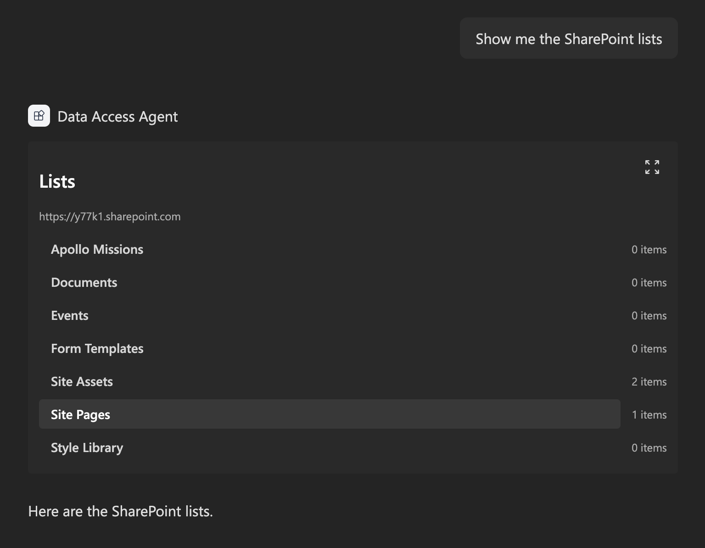
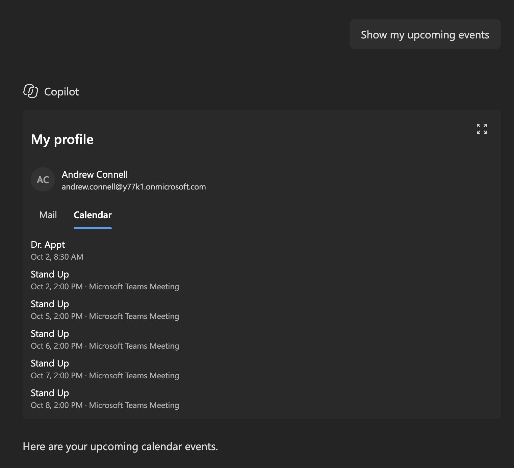

# Access data with the SharePoint REST API and Microsoft Graph

## Summary

This sample is the finished solution for the article [Access data from a Copilot UX component](https://learn.microsoft.com/sharepoint/dev/spfx/copilot/access-data). One declarative agent has two Copilot UX components: one shows the lists on a SharePoint site with the SharePoint REST API, and the other shows the signed-in user's profile, recent mail, and upcoming events with Microsoft Graph.

## Compatibility

## Applies to

- [SharePoint Framework](https://learn.microsoft.com/sharepoint/dev/spfx/sharepoint-framework-overview)
- [Microsoft Copilot extensibility](https://learn.microsoft.com/microsoft-365-copilot/extensibility/)
- [Microsoft 365 tenant](https://learn.microsoft.com/sharepoint/dev/spfx/set-up-your-development-environment)

> Get your own free development tenant by subscribing to the [Microsoft 365 developer program](https://aka.ms/m365/devprogram)

## Contributors

- [Andrew Connell](https://github.com/andrewconnell)

## Version history

| Version | Date            | Comments        |
| ------- | --------------- | --------------- |
| 1.0     | October 4, 2026 | Initial release |

## Prerequisites

- The Node.js version in the `engines` field of `package.json`
- Permission to deploy to the tenant app catalog
- Permission to approve API access requests in the SharePoint admin center. The `MyProfile` component needs the Microsoft Graph permissions `User.Read`, `Mail.Read`, and `Calendars.Read`.

## Minimal path to awesome

- Clone this repository (or [download this solution as a .ZIP file](https://pnp.github.io/download-partial/?url=https://github.com/pnp/spfx-copilot-components/tree/main/samples/tutorial-access-data) then unzip it)
- From your command line, change your current directory to the directory containing this sample (`tutorial-access-data`, located under `samples`)
- In the command line run:
  - `npm install`
  - `npx heft start --nobrowser`
- Go to the Copilot Workbench at `https://<tenant>.sharepoint.com/_layouts/15/copilotworkbench.aspx` and accept the loading of debug manifests.

To deploy the sample to Microsoft 365 Copilot:

- In the command line run `npm run build`.
- Upload `sharepoint/solution/tutorial-access-data.sppkg` to the tenant app catalog and select **Enable app**.
- In the SharePoint admin center, go to **Advanced** > **API access** and approve the `User.Read`, `Mail.Read`, and `Calendars.Read` requests for Microsoft Graph.
- In the app catalog, select the app and select **Add to Teams**.
- In Microsoft 365 Copilot, find the agent and add it. A new agent can take some time to appear; signing out and in again can help.

## Features

The solution contains one declarative agent and two Copilot UX components:

| Component | Tool | Data source |
| --- | --- | --- |
| `SharePointLists` | `ShowSharePointLists` | SharePoint REST API through `spHttpClient` |
| `MyProfile` | `ShowMyProfile` | Microsoft Graph through `msGraphClientFactory` |

All code runs in the browser. The solution package is the only thing to deploy.

This sample illustrates the following concepts:

- calling the SharePoint REST API with `spHttpClient` from a Copilot UX component
- calling Microsoft Graph with `msGraphClientFactory` and requesting permissions in `package-solution.json`
- loading data in the view so the component renders right away with a loading state
- showing a clear message when a Microsoft Graph permission isn't approved
- two tools in one agent, with descriptions that tell Copilot which tool to use

## Help

We do not support samples, but this community is always willing to help, and we want to improve these samples. We use GitHub to track issues, which makes it easy for community members to volunteer their time and help resolve issues.

You can try looking at [issues related to this sample](https://github.com/pnp/spfx-copilot-components/issues) to see if anybody else is having the same issues.

If you encounter any issues using this sample, [create a new issue](https://github.com/pnp/spfx-copilot-components/issues/new).

## Disclaimer

**THIS CODE IS PROVIDED _AS IS_ WITHOUT WARRANTY OF ANY KIND, EITHER EXPRESS OR IMPLIED, INCLUDING ANY IMPLIED WARRANTIES OF FITNESS FOR A PARTICULAR PURPOSE, MERCHANTABILITY, OR NON-INFRINGEMENT.**

