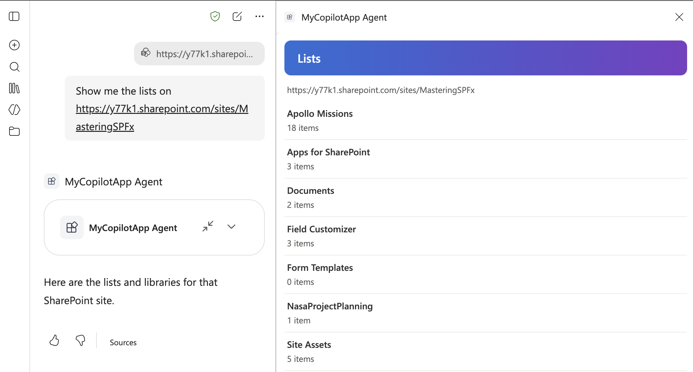
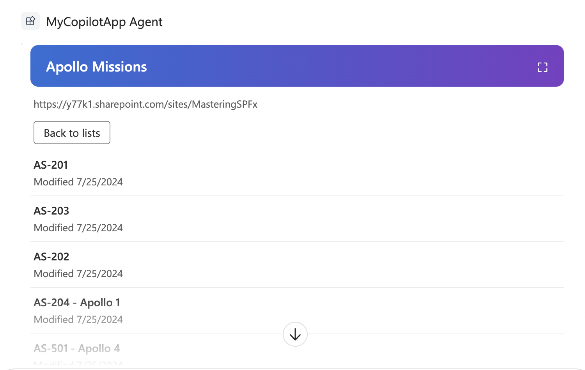

# Lists and items on a site

## Summary

This sample is the finished project for the tutorial [Connect your Copilot UX component to SharePoint data](https://learn.microsoft.com/sharepoint/dev/spfx/copilot/get-started/connect-to-sharepoint-data). It's the `my-copilot-app` project from [Build your first SharePoint Copilot App](https://learn.microsoft.com/sharepoint/dev/spfx/copilot/get-started/build-your-first-copilot-app) with the changes from the tutorial applied.

## Compatibility

## Applies to

- [SharePoint Framework](https://learn.microsoft.com/sharepoint/dev/spfx/sharepoint-framework-overview)
- [Microsoft Copilot extensibility](https://learn.microsoft.com/microsoft-365-copilot/extensibility/)
- [Microsoft 365 tenant](https://learn.microsoft.com/sharepoint/dev/spfx/set-up-your-development-environment)

> Get your own free development tenant by subscribing to the [Microsoft 365 developer program](https://aka.ms/m365/devprogram)

## Contributors

- [Andrew Connell](https://github.com/andrewconnell)

## Version history

| Version | Date            | Comments        |
| ------- | --------------- | --------------- |
| 1.0     | October 4, 2026 | Initial release |

## Prerequisites

- The Node.js version in the `engines` field of `package.json`
- Permission to deploy to the tenant app catalog

## Minimal path to awesome

- Clone this repository (or [download this solution as a .ZIP file](https://pnp.github.io/download-partial/?url=https://github.com/pnp/spfx-copilot-components/tree/main/samples/tutorial-connect-to-sharepoint-data) then unzip it)
- From your command line, change your current directory to the directory containing this sample (`tutorial-connect-to-sharepoint-data`, located under `samples`)
- In the command line run:
  - `npm install`
  - `npx heft start --nobrowser`
- Go to the Copilot Workbench at `https://<tenant>.sharepoint.com/_layouts/15/copilotworkbench.aspx` and accept the loading of debug manifests.
- Activate the component and select **Fire turn** with the properties `{"siteUrl":"https://<tenant>.sharepoint.com/sites/<site>"}`.

To deploy the sample to Microsoft 365 Copilot:

- In the command line run `npm run build`.
- Upload `sharepoint/solution/my-copilot-app.sppkg` to the tenant app catalog and select **Enable app**.
- In the app catalog, select the app and select **Add to Teams**.
- In Microsoft 365 Copilot, find the agent and add it. A new agent can take some time to appear; signing out and in again can help.

## Features

The `MyCopilotApp` component shows the lists on a SharePoint site and the first 25 items of the list the user selects. The agent passes the site to the `MyCopilotAppTool` tool in the `siteUrl` parameter.

All code runs in the browser. The solution package is the only thing to deploy.

This sample illustrates the following concepts:

- defining a tool parameter with a Zod schema and describing it so Copilot fills it in from the prompt
- describing the tool and the agent instructions so Copilot calls the tool from a natural prompt
- calling the SharePoint REST API with `spHttpClient` from a Copilot UX component built with no framework
- handling a missing URL, a URL that isn't a site, a site the user can't access, and a site that doesn't exist
- testing the component in the Copilot Workbench with tool properties

## Help

We do not support samples, but this community is always willing to help, and we want to improve these samples. We use GitHub to track issues, which makes it easy for community members to volunteer their time and help resolve issues.

You can try looking at [issues related to this sample](https://github.com/pnp/spfx-copilot-components/issues) to see if anybody else is having the same issues.

If you encounter any issues using this sample, [create a new issue](https://github.com/pnp/spfx-copilot-components/issues/new).

## Disclaimer

**THIS CODE IS PROVIDED _AS IS_ WITHOUT WARRANTY OF ANY KIND, EITHER EXPRESS OR IMPLIED, INCLUDING ANY IMPLIED WARRANTIES OF FITNESS FOR A PARTICULAR PURPOSE, MERCHANTABILITY, OR NON-INFRINGEMENT.**

