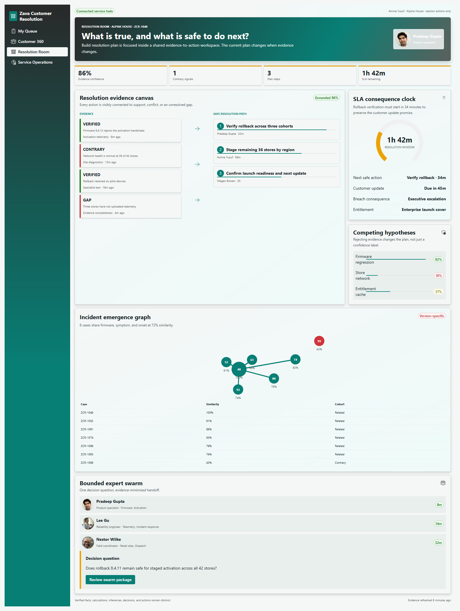
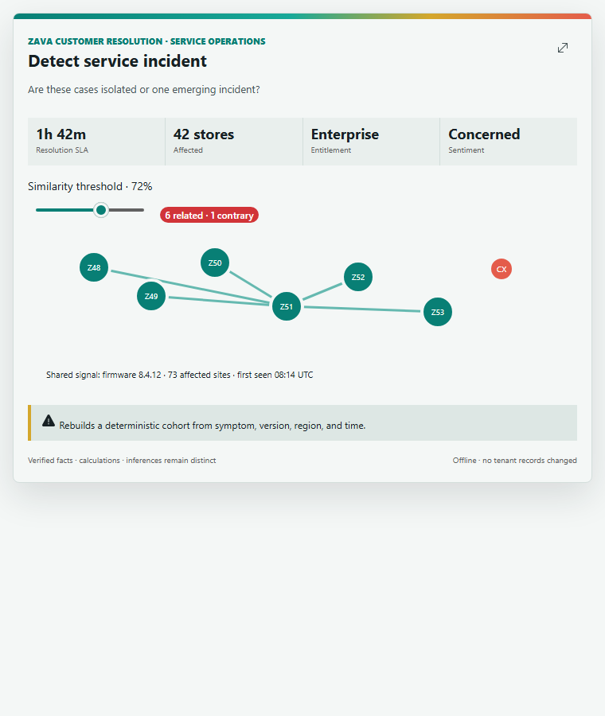
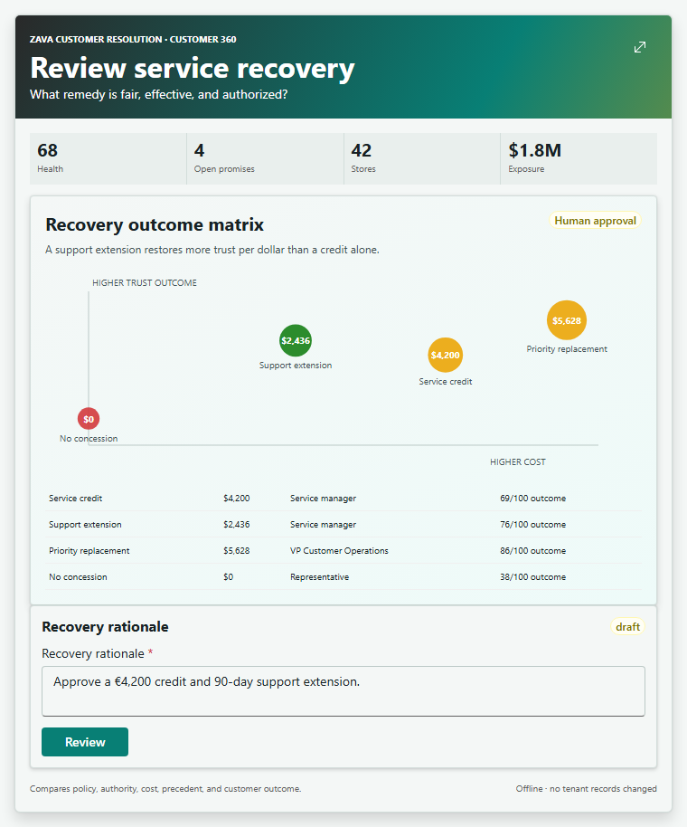
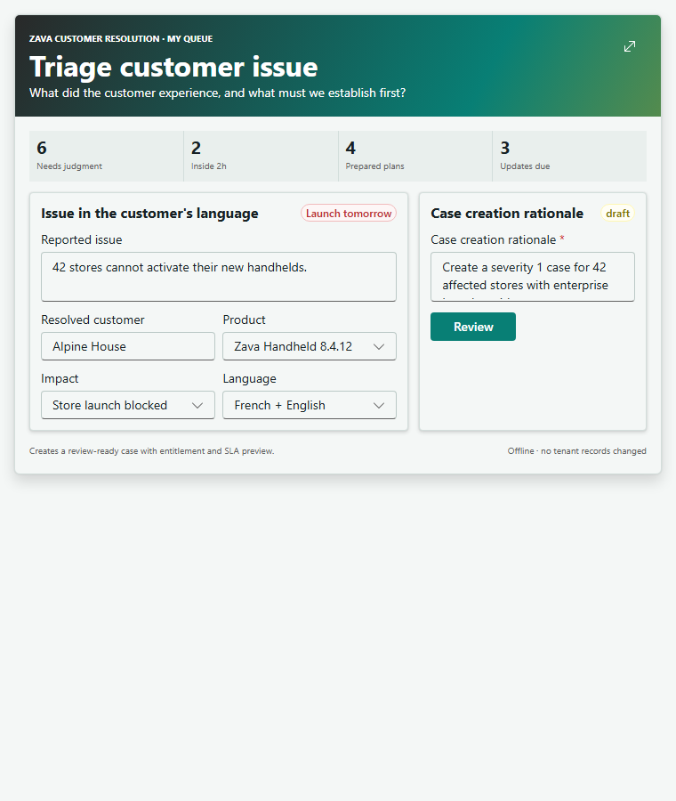

# Zava Customer Resolution Center

> [!IMPORTANT]
> **Status: OFFLINE SHOWCASE IMPLEMENTED - EXTERNAL GATES REMAIN.** All 22 operational Copilot
> Components plus the capability explorer have immutable Yeoman-generated identities and one shared
> React 18 bundle. A coherent 12-customer/500-case service graph, purpose-specific inline experiences,
> four distinct dashboards, D3 chart/map geometry, persona media, publication automation, and package
> audits are implemented. Authenticated tenant routing/host accessibility, localization/RTL completion,
> and public media-rights approval remain explicit release gates.

> **Planned sample type:** self-contained, offline-first SPFx Copilot Components showcase<br>
> **Planned catalog:** 22 operational inline components + 1 capability explorer<br>
> **Planned full-screen model:** 4 role-aware lenses in one shared application<br>
> **Reference quality bar:** [Zava Innovation Hub](../zava-innovation-portfolio/README.md) and its
> [agentic creation rules](../zava-innovation-portfolio/agentic-creation-rules.md)

## Screenshots

### Resolution Room



### Incident emergence



### Service recovery



Mobile and dark-mode evidence is available in
[assets/fullscreen-resolution-room-mobile.png](assets/fullscreen-resolution-room-mobile.png) and
[assets/fullscreen-resolution-room-dark.png](assets/fullscreen-resolution-room-dark.png).

### Complete inline component gallery

| | | |
| --- | --- | --- |
| **Balance service workload**<br> |  | **Compose customer update**<br> |
| **Coordinate field service**<br> |  | **Detect service incident**<br> |
| | **Explore agent capabilities**<br> | **Explore customer health**<br> |
| **Explore service performance**<br> | **Priority service queue**<br> | **Manage case escalation**<br> |
| **Explore regional service impact**<br> | **Explore recurring service drivers**<br> | **Manage customer commitments**<br> |
| **Plan customer win-back**<br> | **Review entitlement coverage**<br> | **Review incident response**<br> |
| **Review service recovery**<br> | **Run service quality review**<br> | **Start expert swarm**<br> |
| **Track resolution outcome**<br> | **Triage customer issue**<br> | |

The machine-readable mapping from component intent to screenshot, layout, entry mode, and alt text is
[assets/component-screenshot-index.json](assets/component-screenshot-index.json).

## Demo and review assets

- [Zava-Customer-Resolution-4-Minute-Keynote.md](Zava-Customer-Resolution-4-Minute-Keynote.md)
- [Zava-Customer-Resolution-10-Minute-Business-Demo.md](Zava-Customer-Resolution-10-Minute-Business-Demo.md)
- [Zava-Customer-Resolution-5-Minute-Technical-Demo.md](Zava-Customer-Resolution-5-Minute-Technical-Demo.md)
- [Zava-Customer-Resolution-Designer-Review.md](Zava-Customer-Resolution-Designer-Review.md)
- [Zava-Customer-Resolution-Routing-Matrix.md](Zava-Customer-Resolution-Routing-Matrix.md)

The tenant-free matrix renders all 23 tools at standard light, narrow light, and standard dark, plus
all four dashboard defaults at keynote light, desktop dark, and mobile light. The current matrix has
81 captures, zero runtime/overflow/image/chart failures, and 36 unique layout identities. The flagship
inline gate adds 24 submit/review/chart checks and 22 stage, narrow, and dark screenshots. Local evidence
does not substitute for authenticated Workbench CSP, routing, iframe focus, forced-colors, or host
screen-reader validation.

## Build and deploy

Prerequisites are Node.js 22.14 or later in the Node 22 line and an SPFx 1.24 Beta 3 compatible
environment.

```powershell
npm ci
npm run test
npm run build
```

The ready-to-deploy offline package is
[sharepoint/solution/zava-customer-resolution-center.sppkg](sharepoint/solution/zava-customer-resolution-center.sppkg).
This release uses Teams/declarative-agent app version **1.0.1**, SPFx solution and feature version
**1.0.0.1**, and sample package version **0.0.2**.
The validated package is 369,440 bytes with SHA-256
`3f9104422470d80a81691698326c1e10688d038561ab1763c80a99943a5d14d8`. It contains one 605,450-byte
hashed JavaScript asset, one current agent ZIP, five unique provenance-matched portraits, and 23
Copilot Component definitions.

## Business story

**A customer reports a problem once. The agent assembles the whole situation; people resolve the
exception with empathy and control; the organization learns before the next customer is affected.**

Service representatives lose time reconstructing context across messages, calls, products,
entitlements, orders, previous cases, knowledge, engineering updates, and internal experts. Traditional
service consoles expose those records but still require a person to navigate and reconcile them. This
sample demonstrates a different interaction model:

1. A service representative describes the issue or names the case in Copilot.
2. Copilot selects one bounded component and initializes the customer, issue, scope, or draft.
3. The component resolves deterministic records and presents the exact business job inline.
4. The representative inspects facts, corrects inferences, changes the plan, and reviews consequences.
5. Consequential actions stop for authority checks, explicit confirmation, and a semantic receipt.
6. Full screen continues from the same customer, case, filters, plan, or recovery scenario.
7. Confirmed session actions update operations, customer health, incident, and outcome views.

This is an **external customer service and success** scenario. It must not become an employee IT help
desk reskin. Customer promise, commercial relationship, entitlement, sentiment, retention exposure,
service recovery, localization, and verified resolution are first-class domain concepts.

## Market-informed product position

This is a design benchmark, not a procurement comparison or a claim of feature parity. Public product
baselines for enterprise customer service consistently include omni-channel case intake, unified
customer context, routing and prioritization, entitlement/SLA management, knowledge, guided resolution,
collaboration, incident management, customer communication, service recovery, automation, and
operational analytics. Current reference surfaces include:

- [Salesforce Service Cloud](https://www.salesforce.com/service/cloud/): case management, unified
  workspace, knowledge, incident response, collaborative swarming, self-service, and analytics.
- [ServiceNow Customer Service Management](https://www.servicenow.com/products/customer-service-management.html):
  cross-enterprise resolution workflows, self-service, summaries, recommended actions, routing, and
  service operations.
- [Microsoft Dynamics 365 Customer Service](https://www.microsoft.com/en-us/dynamics-365/products/customer-service):
  Microsoft ecosystem baseline for case management, knowledge, routing, channels, and representative
  productivity.
- [Microsoft 2025 Work Trend Index](https://www.microsoft.com/en-us/worklab/work-trend-index/2025-the-year-the-frontier-firm-is-born):
  global leaders identified customer service among the top three areas for accelerated AI investment.

The sample modernizes the operating model rather than recreating a service console screen for screen:

| Traditional service pattern | Copilot Components modernization |
| --- | --- |
| A representative searches multiple tabs to reconstruct the case. | Natural-language intent opens one evidence-complete component for the current issue. |
| AI writes a summary beside the existing workflow. | The agent assembles evidence; deterministic UX owns plan editing, policy, SLA, validation, and action. |
| Suggested replies hide unsupported commitments in prose. | Facts, inferences, promises, exclusions, and approval requirements are visibly separable and editable. |
| Escalation sends an unstructured message to another queue. | An expert swarm receives a reviewed evidence package, named decision question, owners, and due time. |
| Service recovery is a separate approval form. | Recovery options show authority, cost, precedent, retention impact, and customer outcome before confirmation. |
| Dashboards report yesterday's service operation. | Decision-specific visuals appear inline; full screen coordinates customer, incident, and operations context. |

Do not use Gartner branding, proprietary quadrant language, or unsupported market-leadership claims.
Industry expectations inform scenario completeness; the sample proves an interaction model.

## Showcase objectives

| Objective | GA proof |
| --- | --- |
| Resolve work inline | Triage, planning, recovery review, communication, expert collaboration, and knowledge capture have complete useful inline states. |
| Make trust inspectable | Verified facts, deterministic calculations, agent inference, recommendations, and human decisions have distinct treatments. |
| Preserve human empathy and authority | The representative edits tone and commitments; concessions, incident declarations, and sends require review and confirmation. |
| Demonstrate material adaptation | Customer tier, entitlement, product, severity, language, sentiment, and evidence change ranking, SLA, plan, geometry, and required approvals. |
| Continue exact context | Expand preserves customer, case, selected evidence, filters, draft, scenario, and workflow step. |
| Tell one connected story | A store activation issue becomes a case, resolution plan, expert swarm, incident, recovery decision, customer update, outcome, and knowledge article. |
| Show premium domain UX | Case constellation, SLA consequence clock, resolution evidence canvas, recovery simulator, and incident emergence map are signature visuals. |

## Plan review and implementation thesis

The scenario is sufficiently understood to plan and prototype, but implementation begins only after
the open decisions in `todo.md` are approved. The keynote thesis is narrower than the complete catalog:

> **Copilot does not replace the service representative. It turns a fragmented customer exception into
> a shared, inspectable resolution object that each role can safely advance.**

The primary proof is Alpine House / `ZCR-1048`. One deterministic record must connect issue intake,
entitlement, diagnostics, SLA consequence, expert work, incident scope, recovery authority, customer
communication, confirmed outcome, and reusable knowledge. The audience should see state propagate
between roles; a sequence of unrelated polished screens is not enough.

The keynote cut is a focused six-beat journey: assemble the issue, challenge an inference, rebuild the
resolution plan, reveal the incident pattern, compare and confirm recovery, then show the customer and
operations outcome. The eight-interface choreography below is the extended business demo. The broader
20-tool catalog proves product depth outside the main-stage path.

Implementation must give equal weight to five concerns that are easy to under-specify:

- **Trust grammar:** verified fact, deterministic calculation, inference, recommendation, human
  decision, and session action remain visually and semantically distinct.
- **State propagation:** each confirmed action changes a later role's useful state and Reset restores
  one immutable seed graph.
- **Internal/customer boundary:** internal diagnostics, commercial exposure, and specialist notes never
  leak into customer-visible communication without an explicit reviewed transformation.
- **Failure choreography:** stale evidence, partial source failure, permission limits, policy conflict,
  bridge failure, and offline/session-only operation receive designed recovery paths.
- **Demo resilience:** every live beat has deterministic setup, reset, expected route, timing, and a
  screenshot fallback that tells the same story.

## End-to-end operating model

| Phase | Business job | Agentic experience | Owning component |
| --- | --- | --- | --- |
| 1. Listen | Capture an issue in the customer's language and channel. | Natural-language issue becomes a reviewable case draft with customer and product resolution. | `TriageCustomerIssue` |
| 2. Prioritize | Decide what needs attention now. | Queue ranks impact, entitlement, SLA, sentiment, customer value, and confidence with exact reasons. | `GetPriorityServiceQueue` |
| 3. Understand | Reconstruct the relationship and current issue. | Timeline connects contacts, products, cases, commitments, sentiment, commercial context, and source freshness. | `ExploreCustomerHealth` |
| 4. Plan | Build a safe, evidence-grounded resolution. | Editable steps cite diagnostics, knowledge, prior resolutions, policy, owners, and contrary evidence. | `BuildResolutionPlan` |
| 5. Collaborate | Bring the right specialist to one decision. | Skills and ownership identify experts; a reviewed context package starts a bounded swarm. | `StartExpertSwarm` |
| 6. Detect | Determine whether one case is a broader incident. | Similar cases cluster by symptom, version, product, geography, and time. | `DetectServiceIncident` |
| 7. Govern | Declare, escalate, mitigate, or close an incident. | Impact, workaround, confidence, audience, and consequence precede explicit human decision. | `ReviewIncidentResponse` |
| 8. Recover | Choose a fair commercial remedy. | Credit, refund, replacement, extension, or no-concession scenarios show policy and business impact. | `ReviewServiceRecovery` |
| 9. Communicate | Send an accurate, empathetic update. | Localized channel-aware draft separates verified facts and commitments; review precedes send. | `ComposeCustomerUpdate` |
| 10. Verify | Confirm the customer outcome and service promise. | SLA, customer confirmation, reopen risk, cost, and next check are tracked. | `TrackResolutionOutcome` |
| 11. Learn | Turn a proven resolution into reusable knowledge. | Applicability, exclusions, evidence, owner, review date, and provenance form a reviewed article. | `CreateKnowledgeFromResolution` |
| 12. Improve | Find systemic service opportunities. | Leaders coordinate demand, backlog, SLA, quality, cost, sentiment, geography, and recurring drivers. | `ExploreServicePerformance` |

## Audiences and full-screen information architecture

Full screen is one shared application with four stable lenses. It is not four apps and not a generic
dashboard enlarged from inline.

| Lens | Persona and category benchmark | Decision question and data grain | Unique default and work | Must not become |
| --- | --- | --- | --- | --- |
| **My Queue** | Megan Bowen, customer success manager; omni-channel judgment queue and customer-priority patterns. | “What needs my judgment now?” Case and next-action grain. | Ranked cases beside one selected case, SLA consequence, prepared work, and a keyboard-efficient next action. Prioritize, plan, communicate, escalate, and verify. | A KPI dashboard or a miniature Resolution Room. |
| **Customer 360** | Megan Bowen, customer success manager; relationship health, success planning, and commitment-management patterns. | “Why does this issue matter to the relationship?” Customer, goal, commitment, and interaction grain. | Relationship constellation, product adoption, service history, bilateral promises, sentiment movement, and retention exposure. Coordinate follow-up, recovery, and win-back. | A CRM field dump or a duplicate case timeline. |
| **Resolution Room** | Pradeep Gupta, product specialist; major-case, diagnostic workbench, and collaborative swarm patterns. | “What is true, what should we try, and is it safe to act?” Evidence, hypothesis, plan-step, and incident-candidate grain. | Evidence canvas as the dominant workspace, coordinated with diagnostics, SLA consequence, experts, incident signal, and bounded action review. | A generic dashboard, chat transcript, or customer-profile page. |
| **Service Operations** | Joni Sherman, VP Customer Operations; service operations command, incident, quality, and workforce patterns. | “Where will intervention prevent customer harm?” Cohort, queue, region, driver, and outcome grain. | Demand-to-resolution river, incident emergence, SLA distribution, recovery outcome/cost, capacity, quality, and named interventions. | Four KPI cards or an enlarged queue. |

### Lens behavior

**My Queue** prioritizes action over metrics. Its first viewport combines the ranked queue and selected
case, with status, owner, SLA, customer sentiment, entitlement, and one recommended next action. It
supports keyboard-efficient movement between queue, detail, plan, and confirmation.

**Customer 360** is relationship-oriented rather than a CRM record dump. The case constellation is
anchored to customer goals and commitments. Service history, product adoption, commercial context, and
sentiment reveal why the current issue matters. Sensitive commercial data is permission-aware in the
future live adapter and clearly marked in mock mode.

**Resolution Room** opens an active-resolution portfolio when no case is in context: demand trend,
incident emergence, active-customer counts, and ranked resolution rooms answer where work is stuck.
Selecting a room opens case and customer evidence, relationship consequence, SLA, and resolution path;
**Back to active resolutions** restores the portfolio. Expanding a case-scoped inline component skips
the portfolio and preserves that exact case. Narrow layouts preserve the same sequence.

**Service Operations** answers where leadership action changes outcomes. It uses unframed analytical
regions, not a grid of equal KPI cards. A service demand river, incident emergence map, SLA distribution,
recovery cost/outcome matrix, and recurring-driver Pareto coordinate through shared filters and selection.

### Leadership visual answers

The catalog keeps 23 immutable tools and promotes three distinct leadership chart questions instead of combining
near-duplicate summary components:

| Leadership question | Owning inline component | Visual answer |
| --- | --- | --- |
| Where is demand changing, and where should leadership intervene? | `ExploreServicePerformance` | Demand-to-resolution river, projected global impact map, recurring-driver Pareto, and exact tables. |
| Is one customer issue becoming a broader incident? | `DetectServiceIncident` | Threshold-controlled cohort graph with related and contrary cases. |
| Where is capacity creating customer-facing SLA risk? | `BalanceServiceWorkload` | Capacity-versus-SLA-risk bubble matrix sized by open demand, with exact team values. |
| Where is resolution work stuck across customers? | Resolution Room unscoped entry | Active-customer portfolio, demand river, incident emergence, and ranked drill-in rooms. |

This intentionally contrasts charts, map, network graph, matrix, portfolio, and customer constellation
layouts with the review forms and queues elsewhere in the catalog.

## Inline component portfolio

The target is **22 operational Copilot Components plus one education component**. The expanded catalog
covers the full role system: representative, supervisor, product specialist, field coordinator,
recovery approver, customer success manager, knowledge lead, quality lead, and service executive.
Supporting modules
such as customer lookup, SLA calculation, duplicate evidence, sentiment history, policy detail, and
source inspection belong inside the owning component and must not become separate tools.

### Sweet-spot inline scenarios

These six scenarios are the primary conversation starters and Microsoft keynote path. Together they
demonstrate two compact submissions, two one-at-a-time review queues, and two focused visual answers.

| Type | Starter intent | Inline experience | Intent resolution route |
| --- | --- | --- | --- |
| Submit | `TriageCustomerIssue` | Four-field case intake -> Review -> Create case -> session receipt | `my-queue/new-case` |
| Submit | `ComposeCustomerUpdate` | Verified facts and editable customer message -> Review -> mock-send receipt | `customer-360/communications` |
| Review | `ReviewIncidentResponse` | Three incident candidates -> selected decision/rationale -> confirm -> next item | `resolution-room/incident-review` |
| Review | `ReviewServiceRecovery` | Three recovery requests -> remedy/amount/authority review -> confirm -> next item | `customer-360/service-recovery` |
| Visual | `DetectServiceIncident` | Threshold-controlled emergence graph with three headline values and exact cohort disclosure | `service-operations/incident-detection` |
| Visual | `ExploreServicePerformance` | Period-controlled demand river with peak/current/change and exact-value disclosure | `service-operations/demand` |

Full screen continues the same selected entity or analytical scope; it does not replace the useful
inline create, review, or answer loop. Detection does not declare an incident, entitlement does not
approve recovery, and aggregate demand does not absorb regional or recurring-driver analysis.

| Model | Count | Required contract |
| --- | ---: | --- |
| Information / interactive analysis | 11 | Answer the question immediately, then allow material filtering, selection, comparison, or chart-mode changes. |
| Submit / create | 6 | Prompt-prefilled draft -> validation -> review -> explicit confirmation -> session receipt. |
| Review / decision | 5 | Queue/record -> evidence and consequence -> decision draft -> confirmation -> session receipt. |
| Education / discovery | 1 | Search/filter all operational scenarios, copy realistic prompts, and preview without confirming actions. |

### Final target catalog

| # | Component | Model | Prompt properties | First useful inline state | Material interaction and guarded action | Exact full-screen continuation |
| ---: | --- | --- | --- | --- | --- | --- |
| 1 | `TriageCustomerIssue` | Submit | `message`, `customerHint`, `productHint`, `channel`, `language` | Compact four-field intake with visible entitlement and SLA consequence. | Draft, validation, structured Review, Edit, Create case, receipt, and Start another replace one another in a bounded region. | `my-queue/new-case`; preserves draft, customer/product, validation, and stage. |
| 2 | `GetPriorityServiceQueue` | Information | `ownerScope`, `team`, `priority`, `slaState`, `sentiment`, `region`, `product`, `limit` | Ranked queue with reason chips, SLA remaining, customer impact, sentiment, owner, and prepared-work state. | Filters rebuild rank and counts; selection opens concise evidence and next action. Reassign/escalate requires review. | `my-queue/priority`; preserves filters, sort, selected case, and scroll position. |
| 3 | `ExploreCustomerHealth` | Information | `customerId`, `period`, `product`, `healthDimension`, `selectedEventId` | Customer outcome strip plus constellation timeline of goals, interactions, products, cases, commitments, and sentiment shifts. | Period/dimension changes the graph; selection coordinates source detail and accountable owner. | `customer-360/overview`; preserves customer, period, dimension, and event. |
| 4 | `BuildResolutionPlan` | Submit | `caseId`, `goal`, `includeDiagnostics`, `includeKnowledge`, `targetResolutionAt` | Editable plan with ordered steps, supporting/conflicting evidence, confidence, owners, SLA consequence, and unresolved assumptions. | Add/remove/reorder steps, select evidence, assign owner, change due time, mark assumption. Validation blocks unsupported promises. Confirm saves session plan receipt, not external execution. | `resolution-room/plan`; preserves case, plan draft, evidence selection, and current step. |
| 5 | `StartExpertSwarm` | Submit | `caseId`, `decisionQuestion`, `skills`, `urgency`, `region`, `candidateIds` | Recommended specialists with role/skill/availability evidence and a reviewed context-package outline. | Select experts, edit question/scope/due time, exclude sensitive evidence, preview Teams-shaped handoff. Confirm creates session swarm receipt. | `resolution-room/swarm`; preserves candidates, selection, package, and draft. |
| 6 | `DetectServiceIncident` | Information | `caseId`, `product`, `region`, `period`, `similarityThreshold` | One focused emergence graph with integrated threshold, related/contrary/strongest values, and collapsed exact cohort data. | Threshold changes cohort membership, chart connections, exact values, and visible-state summary. | `service-operations/incident-detection`; preserves cohort and threshold. |
| 7 | `ReviewIncidentResponse` | Review | `caseId`, `focus`, `selectedId` | Compact three-candidate queue beside one selected incident decision. | Select/Previous/Next, edit Declare/Monitor/Close, cadence and rationale, Review/Edit/Confirm, receipt, and automatic next-item advance. | `resolution-room/incident-review`; preserves candidate, queue position, and decision draft. |
| 8 | `ReviewServiceRecovery` | Review | `caseId`, `amount`, `focus`, `selectedId` | Compact three-request queue with authority, trust lift, precedent, remedy amount, and rationale. | Approve/Request approval/Decline uses Review/Edit/Confirm, receipt, and automatic next-item advance. | `customer-360/service-recovery`; preserves request, queue position, amount, and decision draft. |
| 9 | `ComposeCustomerUpdate` | Submit | `caseId`, `channel`, `language`, `focus` | Compact verified-fact studio with recipient, channel, language, next-update promise, and editable customer-safe message. | Draft, structured Review, Edit, Confirm mock send, receipt, and Start another replace one another in a bounded region. | `customer-360/communications`; preserves case, draft, verified facts, language, and stage. |
| 10 | `TrackResolutionOutcome` | Information | `caseId`, `customerId`, `outcome`, `period`, `selectedMetric` | Resolution scoreline for SLA, customer confirmation, reopen risk, recovery cost, next check, and owner. | Metric and period change evidence; record confirmation or schedule follow-up through reviewed session action. | `customer-360/outcomes`; preserves customer/case, metric, period, and selected evidence. |
| 11 | `CreateKnowledgeFromResolution` | Submit | `caseId`, `audience`, `product`, `version`, `articleType`, `language` | Article canvas with problem, verified resolution, applicability, exclusions, steps, sources, owner, and review date. | Edit applicability and steps; remove sensitive/customer-specific content; validation checks evidence and unsupported generalization. Confirm creates draft article receipt. | `resolution-room/knowledge`; preserves article draft, evidence, validation, and step. |
| 12 | `ExploreServicePerformance` | Information | `period`, `region`, `product`, `focus`, `selectedId` | One focused demand river with period selector, peak/current/change, concise interpretation, and collapsed exact values. | Today, 7-day, and 30-day selections materially change values, geometry, labels, and visible-state summary. | `service-operations/demand`; preserves period and continues into coordinated analytics. |
| 12a | `ExploreRegionalServiceImpact` | Information | `period`, `region`, `product`, `selectedId` | Projected regional impact map with case volume, SLA risk, CSAT, and exact table. | Region selection changes highlighted geography and regional detail. | `service-operations/regional-impact`; continues into coordinated analytics. |
| 12b | `ExploreRecurringServiceDrivers` | Information | `period`, `product`, `focus`, `selectedId` | Recurring-driver Pareto ranking avoidable customer effort by cause. | Product selection changes drivers, bars, shares, and exact values in full screen. | `service-operations/recurring-drivers`; continues into coordinated analytics. |
| 13 | `DiagnoseCaseEvidence` | Information | `caseId`, `diagnosticType`, `product`, `version`, `timeRange`, `selectedSignalId` | Diagnostic workbench with symptom timeline, telemetry, known changes, prior fixes, competing hypotheses, confidence, and evidence gaps. | Selecting signals and excluding bad evidence recalculates hypothesis support; a specialist can promote verified findings into the owning resolution plan. | `resolution-room/diagnostics`; preserves case, hypothesis, time range, signals, and selection. |
| 14 | `ReviewEntitlementCoverage` | Information | `caseId`, `customerId`, `product`, `requestedRemedy`, `serviceDate`, `region` | Coverage ledger showing contract, warranty, SLA, exclusions, consumption, requested remedy, and effective-date evidence. | Changing remedy/date/product recalculates coverage, response obligation, exception path, and authority without approving anything. | `customer-360/entitlement`; preserves customer/case, remedy scenario, selected clause, and effective date. |
| 15 | `ManageCaseEscalation` | Review | `caseId`, `targetQueue`, `severity`, `reason`, `ownerId`, `dueAt` | Escalation canvas with current attempts, authority boundary, target team capacity, required context, SLA consequence, and acceptance criteria. | Escalate/return/retain requires target, owner, reason, due time, reviewed evidence package, confirmation, and receipt. | `my-queue/escalation`; preserves case, target, owner, package, and decision draft. |
| 16 | `BalanceServiceWorkload` | Information | `team`, `period`, `skill`, `region`, `channel`, `selectedCaseId`, `selectedOwnerId` | Capacity board combining queue age, skills, language, availability, case complexity, SLA exposure, and owner load. | Filters and what-if reassignment redraw workload and SLA exposure; confirmed reassignment uses a reviewed action rather than drag-and-drop automation. | `service-operations/workload`; preserves filters, selected case/owner, and proposed assignment. |
| 17 | `CoordinateFieldService` | Submit | `caseId`, `siteIds`, `skill`, `parts`, `serviceWindow`, `technicianIds` | Dispatch planner with affected sites, route/time windows, required skills/parts, technician availability, customer constraints, and visit readiness. | Select sites/technician/window/parts; route and SLA consequence update. Review and confirmation create session dispatch receipts. | `resolution-room/field-service`; preserves sites, technician, route scenario, parts, and step. |
| 18 | `ManageCustomerCommitments` | Review | `customerId`, `caseId`, `period`, `status`, `selectedCommitmentId` | Promise ledger separating company and customer commitments with owner, source, due date, evidence, risk, and downstream dependency. | Complete/renegotiate/escalate a promise with evidence and customer-impact preview; changes require review and receipt. | `customer-360/commitments`; preserves filters, selected promise, evidence, and action draft. |
| 19 | `RunServiceQualityReview` | Review | `caseId`, `reviewType`, `criteria`, `selectedFindingId`, `proposedOutcome` | Quality scorecard for process adherence, resolution correctness, communication, knowledge use, customer effort, and coaching evidence. | Reviewers accept/edit findings and record pass/coaching/remediation with named owner and confirmation; no opaque agent quality score. | `service-operations/quality-review`; preserves case, criteria, findings, and outcome draft. |
| 20 | `PlanCustomerWinBack` | Submit | `customerId`, `riskReason`, `objective`, `offers`, `ownerIds`, `targetDate` | Retention plan with relationship evidence, unresolved harms, stakeholders, recovery actions, commercial guardrails, success measures, and timeline. | Editing actions/offers recalculates cost, authority, customer outcome range, and dependencies. Confirm creates a reviewed win-back plan, not external outreach. | `customer-360/win-back`; preserves customer, plan draft, scenario, owners, and step. |
| 21 | `ExploreAgentCapabilities` | Education | `query`, `audience`, `operation`, `featuredIntent` | Searchable gallery of all 22 operations with business-language prompts and safe previews. | Filter/search/copy prompt/preview. Submit and review previews stop before confirmation. | Isolated `education/capabilities`; preserves search, filters, and featured intent. |

### Ownership and routing boundaries

- `TriageCustomerIssue` creates or enriches intake; `BuildResolutionPlan` owns work after a case exists.
- `GetPriorityServiceQueue` answers what to work next; it does not duplicate one-case resolution detail.
- `ExploreCustomerHealth` answers relationship context; `TrackResolutionOutcome` verifies one result.
- `DetectServiceIncident` analyzes patterns; `ReviewIncidentResponse` owns the consequential declaration.
- `ReviewServiceRecovery` owns compensation policy and authority; `ComposeCustomerUpdate` owns the
  message and commitments. Neither silently performs the other.
- `CreateKnowledgeFromResolution` starts only from verified resolution evidence and never publishes
  directly from an unconfirmed agent inference.
- `ExploreServicePerformance` owns aggregate operational analysis; it links to selected records rather
  than absorbing queue, case, and review workflows.

## Role and operation coverage

| Role | Moment in the process | Primary inline components | UX forms that earn separate routing |
| --- | --- | --- | --- |
| Customer service representative | Intake, prioritize, plan, communicate, verify | `TriageCustomerIssue`, `GetPriorityServiceQueue`, `BuildResolutionPlan`, `ComposeCustomerUpdate`, `TrackResolutionOutcome` | Guided intake form, ranked queue, editable evidence plan, localized communication studio, outcome scoreline. |
| Team lead / supervisor | Escalate, rebalance, approve recovery, coach | `ManageCaseEscalation`, `BalanceServiceWorkload`, `ReviewServiceRecovery`, `RunServiceQualityReview` | Authority-aware escalation, capacity simulation, recovery scenario review, quality and coaching decision. |
| Product or service specialist | Diagnose, correlate, decide incident, create knowledge | `DiagnoseCaseEvidence`, `DetectServiceIncident`, `ReviewIncidentResponse`, `CreateKnowledgeFromResolution` | Hypothesis canvas, cluster graph, incident consequence review, grounded article form. |
| Field coordinator | Convert resolution into physical service | `CoordinateFieldService`, `ManageCustomerCommitments` | Site/technician/parts planner and bilateral promise ledger. |
| Customer success manager | Understand relationship, govern promises, recover trust | `ExploreCustomerHealth`, `ReviewEntitlementCoverage`, `ManageCustomerCommitments`, `PlanCustomerWinBack` | Relationship constellation, clause ledger, commitment runway, retention plan and scenario. |
| Service executive | Intervene in demand, quality, capacity, incidents, and cost | `ExploreServicePerformance`, `BalanceServiceWorkload`, `RunServiceQualityReview` | Coordinated operational charts with named exceptions and action ownership. |

## Adaptive UX demo choreography

The adaptive story is not that one card changes color. The same case moves through purpose-built forms
as role, business question, evidence, and consequence change:

| Beat | Prompt and role | Component shape | Adaptation that the audience can see |
| ---: | --- | --- | --- |
| 1 | Representative: “A customer cannot activate 42 devices.” | Intake form | Customer/product resolution changes the form from unknown intake to entitlement-aware case creation; severity changes SLA and required evidence. |
| 2 | Specialist: “What is actually causing this?” | Diagnostic hypothesis canvas | Selecting telemetry and rejecting a network hypothesis changes confidence, recommended tests, and the resolution plan. |
| 3 | Supervisor: “Who can take this before SLA breach?” | Capacity and escalation board | Skill, language, owner load, and severity reshape eligible owners and predicted SLA exposure. |
| 4 | Field coordinator: “Plan visits for the stores that failed rollback.” | Map/list dispatch planner | A digital case becomes a site/parts/technician form; changing the window redraws route and commitment risk. |
| 5 | Operations lead: “Is this a broader incident?” | Cluster chart into decision review | Threshold controls alter the cohort; choosing Declare replaces analysis controls with severity, audience, authority, and confirmation. |
| 6 | Recovery approver: “What remedy is fair?” | Scenario simulator | Credit, replacement, extension, and no-concession choices change policy, cost, precedent, and retention outcome. |
| 7 | Customer success: “Keep every promise and recover trust.” | Commitment ledger into win-back plan | Case facts become bilateral commitments, then a relationship plan with stakeholders, offers, success measures, and approval. |
| 8 | Executive: “Where is this pattern hurting customers?” | Operational river and exception drill | The one case becomes a cohort, quality, capacity, cost, and sentiment intervention without losing its causal trail. |

### Showcase story - one issue, eight interfaces

The five-minute demo follows Alpine House from natural-language intake through diagnostic evidence,
workload-aware escalation, field dispatch, incident declaration, recovery approval, customer commitment,
and executive learning. Each confirmed receipt changes the next role's first useful state. Expand always
continues the exact case and current draft; switching role changes the available actions and information
density, not merely the avatar.

## Dynamic inline UX contract

Every inline component is a compact business application, useful at approximately 340 px and polished
at approximately 760 px.

- Shared header: **Zava Customer Resolution** + literal action title + one responsive **Expand** action.
- The body begins with customer work, never prompt echo, extracted-property dumps, chatbot bubbles, or
  generic “AI insight” framing.
- A first viewport answers the intent before exposing secondary detail.
- Forms use appropriate controls, inline validation, required-state summary, review, confirmation, and
  receipt. No prompt-derived value auto-submits.
- Review components support queue -> detail -> evidence -> decision -> consequence -> confirmation ->
  updated queue. Decisions require rationale when policy or risk requires it.
- Charts expose exact values, visible legends, selection detail, keyboard alternatives, and tables.
- Inferences are labeled and individually editable/rejectable. Verified facts show source and freshness.
- SLA and policy calculations disclose inputs and deterministic logic; confidence is never a substitute
  for entitlement or authority.
- Loading, no match, partial source failure, stale source, permission denied, offline mock, and action
  failure states must be designed, not left to generic error text.

## Signature visual system

The product should feel like a calm, high-trust service studio under pressure, distinct from the
Innovation Hub's venture-studio identity.

- **Brand:** “Zava Customer Resolution”; planned agent mark is a speech contour resolving into a check.
- **Palette:** carbon `#172124`, cloud `#F4F7F6`, service teal `#087F75`, signal coral `#E45C4B`, and
  citrus `#D4A72C`; semantic Fluent colors retain their standard meaning.
- **Typography:** compact operational sans for controls and body; a restrained humanist display face
  may be used for customer/account moments in static design, with a package-safe implementation choice.
- **Composition:** left-to-right evidence-to-action flow; connective lines and time are primary visual
  grammar. Cards are limited to cases, people, messages, decisions, and bounded forms.
- **Motion:** case links settle, SLA changes tick once, and plan dependencies reflow in 180-280 ms.
  Reduced motion renders the final state immediately. No perpetual pulse or fake agent waiting.

### Reference adaptation and deliberate differences

The named quality reference is [Zava Revenue Deal Room](../zava-revenue-deal-room/README.md). Its actual
desktop, mobile, dark, inline, media, chart, and package evidence establishes the finish bar. Adapt its
clear hierarchy, restrained elevation, portrait-backed accountability, exact-value D3 patterns,
responsive reflow, owner-document theming, visual harness, and package audits.

Do not copy its blue navigation rail, rainbow progress strip, paper-and-CRM composition, buying-committee
orbit, commercial contour, close runway, forecast bridge, or repeated dashboard module arrangement.
Customer Resolution needs its own recognizable grammar:

- A light, calm service canvas with carbon framing, teal resolution paths, coral exception signals, and
  citrus time/attention markers; dark mode is an equivalent state, not the default identity.
- Time and causality run left to right. Customer language begins the flow; evidence, plan, authority,
  promise, and outcome form a visible chain rather than a set of interchangeable panels.
- The Resolution Room uses an unframed evidence canvas with a persistent SLA edge and bounded decision
  dock. My Queue is dense and operational; Customer 360 is temporal and relational; Service Operations
  is analytical and cohort-led.
- Customer and colleague portraits appear only where identity changes empathy, ownership, expertise, or
  approval. Product/site imagery and channel artifacts carry more visual weight than persona decoration.
- Inline experiences use one decisive visual and one next action. Full screen adds coordinated context
  and operations rather than enlarging the inline card.

The first visual approval set is: inline resolution plan at 340 px and 760 px; desktop Resolution Room;
mobile Resolution Room; dark Resolution Room; recovery review; incident emergence; and one designed
partial-evidence/error state. No sibling component bodies scale out before these pixels pass review.

| Decision question | Signature visual | Planned implementation |
| --- | --- | --- |
| What happened and why does it matter? | Case constellation across customer goals, interactions, products, cases, commitments, and sentiment | React SVG relationships with Fluent DOM timeline/table fallback. |
| How much time and policy room remain? | SLA consequence clock with response/resolution windows and next action | React SVG arc/track plus exact DOM values and calculation disclosure. |
| Is this plan grounded enough to act? | Resolution evidence canvas connecting steps to supporting/conflicting sources | Fluent DOM plan + React SVG connectors; one selected evidence ID coordinates both. |
| What recovery is fair and authorized? | Recovery consequence simulator | DOM controls plus React SVG scenario bands for cost, authority, precedent, and outcome. |
| Is this a broader incident? | Incident emergence graph | Seeded deterministic relationship layout with SVG default; no live force simulation. |
| Where should service leadership intervene? | Demand-to-resolution river and recurring-driver Pareto | React SVG with exact table and coordinated filters. |

## Hero scenarios

### Hero 1 - Store launch rescue

**Prompt:** “Build a resolution plan for Alpine House. Their 42 stores cannot activate the new
handhelds and launch is tomorrow.”

`BuildResolutionPlan` opens inline with the enterprise entitlement, 6-hour resolution window, negative
sentiment, activation telemetry, firmware similarity, and an editable four-step plan. The representative
rejects an inferred network cause, promotes the verified firmware workaround, assigns a product owner,
and expands into Resolution Room. Similar cases cross the incident threshold; a human declares the
incident. A governed service credit and French/English customer update are reviewed and confirmed. The
session ends with customer confirmation and reusable knowledge.

**GA proof:** evidence assembly, correction of inference, dynamic SLA, plan editing, expert handoff,
incident review, recovery approval, localized communication, exact continuation, and downstream state.

### Hero 2 - Executive retention intervention

**Prompt:** “Show why Northwind's service health is falling and what needs executive intervention.”

`ExploreCustomerHealth` shows that product adoption is stable but repeated delivery issues, an unmet
commitment, and slow escalation are driving sentiment and renewal risk. Selection moves from the
constellation to exact sources. Full screen opens Customer 360 on the same event and customer. The
customer success manager assigns a recovery owner and schedules a reviewed executive update.

**GA proof:** relationship context rather than ticket summary, explainable health, source freshness,
cross-functional ownership, and accountable next action.

### Hero 3 - Incident before the dashboard sees it

**Prompt:** “Are today's activation cases isolated, or are we seeing an incident?”

`DetectServiceIncident` clusters cases by firmware, geography, symptom, and onset. Changing the
similarity threshold reveals the pattern is version-specific, not region-specific. The reviewer inspects
contrary cases, opens `ReviewIncidentResponse`, confirms scope and audience, and declares a monitored
incident. Service Operations updates the affected cohort and SLA exposure.

**GA proof:** analytical chart with meaningful controls, exact records, confidence and contrary
evidence, consequential review, confirmation, receipt, and leadership impact.

## Conversation starters

Use exactly six starters; each targets one primary tool.

The generated routing matrix also carries 16 nearest-sibling collision cases. The canonical build
fails if a starter drifts, two starters target the same tool, or an expected positive/negative routing
boundary disappears. Configuration-level checks do not replace fresh-conversation Copilot rehearsal.

| # | Title | Starter | Expected component |
| ---: | --- | --- | --- |
| 1 | Create support case | 42 Alpine House stores cannot activate their handhelds. Create the support case. | `TriageCustomerIssue` |
| 2 | Detect incident | Are today's activation failures isolated or one emerging incident? | `DetectServiceIncident` |
| 3 | Review incident | Review today's activation incident candidates and help me decide the next one. | `ReviewIncidentResponse` |
| 4 | Review recovery | Review pending customer recovery requests, starting with Alpine House. | `ReviewServiceRecovery` |
| 5 | Prepare update | Draft a French and English update for Alpine House with the next update time. | `ComposeCustomerUpdate` |
| 6 | Service performance | Is customer-service resolution keeping up with demand today? | `ExploreServicePerformance` |

## Coherent mock data contract

The offline graph includes 12 curated customers, three per region across AMER, EMEA, APAC, and LATAM,
plus 500 linked cases. This keeps the complete customer directory visible while preserving operational scale.
12 products and versions; 500 cases over 18 months; channels and localized interactions; entitlements;
SLA policies; orders; product telemetry summaries; knowledge articles; diagnostics; commitments;
sentiment events; 8 incident candidates; 3 declared incidents; expert skills and availability; recovery
policies and authority bands; communications; CSAT; reopen events; and verified outcomes.

The hero graph centers on **Alpine House activation incident / ZCR-1048** and remains coherent across
every component. Dates derive from one invocation clock. Currency, dates, numbers, and duration use
`Intl`. Confirmed actions append to a session-only overlay; Reset restores immutable seeds.

### Planned integration boundaries

| Service contract | Mock responsibility | Potential live systems |
| --- | --- | --- |
| `ICustomerServiceDataService` | Customers, contacts, products, cases, entitlements, queues, outcomes | Dynamics 365, Salesforce, ServiceNow, custom CRM/CSM |
| `IWorkContextService` | Meetings, mail-shaped interactions, files, people, expert availability | Microsoft Graph, Work IQ, SharePoint, Teams |
| `IKnowledgeService` | Articles, diagnostics, prior resolutions, source freshness | SharePoint, Dynamics knowledge, ServiceNow, external KB |
| `IPolicyAndSlaService` | SLA clocks, recovery policy, authority, communication constraints | CRM policy, rules engine, Dataverse, custom APIs |
| `IWorkflowService` | Session actions, review, confirmation, receipts | Power Automate, Dynamics workflows, ServiceNow flows |

Production authorization, record retention, legal hold, data residency, customer consent, sensitive
commercial access, and audit enforcement remain system-of-record responsibilities and must not be
claimed by the front-end sample.

## Agentic implementation contract

- One typed intent catalog owns final names, generated GUIDs, schemas, operation model, prompt examples,
  routing exclusions, preview data, and full-screen destinations.
- Every component must be generated with the supported SharePoint Yeoman generator after plan approval;
  never copy or rename a scaffold.
- Copilot resolves intent and bounded parameters. Components resolve records and own calculations,
  validation, state transitions, confirmations, and receipts.
- Fresh invocation is distinct from passive rerender. Inline state survives host resize/theme changes.
- Full-screen route metadata, not component-name conditionals, controls continuation.
- One selected domain ID coordinates charts, evidence, detail, and accessible table selection.
- The production sample is offline and makes no runtime network call. Live adapters are typed extension
  points, not partially working demo dependencies.
- `ExploreAgentCapabilities` previews all operational tools but cannot confirm a submit or review action.

## Global and responsible design requirements

- Externalize strings and validate at least English, German expansion, Japanese, and Arabic RTL.
- Include multi-region names, time zones, currencies, address structures, channels, and language-aware
  communication without cultural stereotypes.
- Put jurisdiction-specific recovery, privacy, recording, and retention behavior behind policy packs.
- Clearly distinguish verified source fact, deterministic calculation, agent inference, recommendation,
  human decision, and automated/session action.
- Never infer protected traits or use sentiment as an automatic denial, escalation, or compensation rule.
- Mask sensitive customer and commercial data by role; mock permission treatments must not imply live
  authorization.
- Validate keyboard, screen reader, 200% zoom, forced colors, reduced motion, narrow inline, mobile full
  screen, long localization, and chart/table equivalence.

## Planned delivery gates

- [ ] **Gate 0 - Plan lock:** README, component ownership, routes, hero journeys, visual designs, market
  baseline, non-goals, identity, and status approved and synchronized to GitHub.
- [ ] **Gate 1 - Creation plan:** copy the approved agentic creation rules into this sample and generate
  a phased `todo.md`, routing matrix, final metadata, GUID plan, and acceptance evidence list.
- [ ] **Gate 2 - Domain graph:** typed deterministic graph, calculations, policies, workflow transitions,
  session overlay, reset, and tests approved before broad UI work.
- [ ] **Gate 3 - UX proof:** implement and validate `BuildResolutionPlan`, `DetectServiceIncident`,
  `ReviewServiceRecovery`, and exact Resolution Room continuation at narrow and wide widths.
- [ ] **Gate 4 - Connected hero:** complete Store launch rescue across personas, confirmations, receipts,
  and downstream updates.
- [ ] **Gate 5 - Catalog:** generate and implement only the approved 22 operational component identities
  plus `ExploreAgentCapabilities`;
  validate routing collisions and safe capability previews.
- [ ] **Gate 6 - Quality:** tests, accessibility, localization/RTL, themes, responsive screenshots,
  source/media provenance, generated plugin, package audit, and clean offline rehearsal pass.
- [ ] **Gate 7 - GA release:** deployable `.sppkg`, README screenshots, five-minute keynote, ten-minute
  business demo, technical walkthrough, telemetry plan, limitations, support owner, and release evidence.

## Explicit non-goals for the showcase

- Replacing a production CRM, contact center, telephony platform, or incident system.
- Live call transcription, emotion detection, biometric inference, or autonomous customer commitments.
- Automatic incident declaration, compensation approval, case closure, knowledge publication, or send.
- A generic chatbot, ticket list, customer KPI dashboard, or employee IT support duplicate.
- Claims of production authorization, compliance, retention, audit, or model accuracy from mock UX.

## Definition of done

The future implementation is complete only when all 22 operational inline components are independently
valuable and routable; the capability explorer safely represents them; all four full-screen lenses have
a useful default; the three hero scenarios run from one deterministic graph; every consequential action
uses review, confirmation, and receipt; exact continuation preserves state; signature visuals have
accessible exact-value alternatives; global, responsive, theme, and accessibility evidence passes; and
an audited offline package deploys with no runtime data dependency.

Implementation status and validation evidence are tracked in [todo.md](todo.md) and
[assets/release-evidence.json](assets/release-evidence.json). The local gate currently reports 41 tests,
zero warnings, 81 visual captures, zero visual failures, 36 unique layout identities, one production
bundle, and zero duplicate media. Local evidence does not claim authenticated host behavior.

