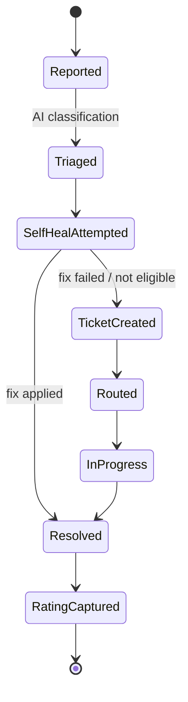
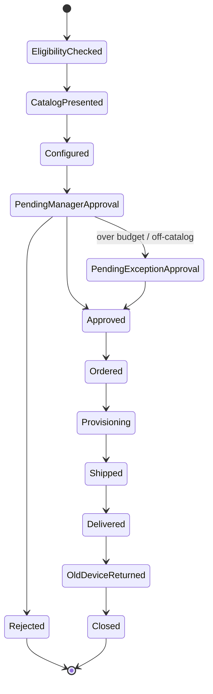

# Zava IT Concierge - SPFx Microsoft 365 Copilot Sample

> **Build target for GitHub Copilot (agent mode):** Scaffold a SharePoint Framework (SPFx) based Microsoft 365 Copilot extensibility sample that delivers a rich, Fluent 2–designed employee IT self‑service experience — as compact **inline components inside the Microsoft 365 Copilot canvas**, each able to **expand into an immersive full‑screen Copilot canvas view** for deeper context, without ever leaving Copilot. This document is the complete product + UX + technical spec. Build exactly what is described here; do not substitute generic/default AI-chat UI patterns.

---

## 1. Elevator pitch

*"My laptop keeps crashing." → diagnosed, self‑healed where possible, refresh‑eligible device recommended, manager approves against live budget, order tracked to the desk — all without leaving Copilot.*

Zava IT Concierge turns the single most universally recognized workplace frustration — broken devices, slow support, opaque approvals — into the platform's signature "wow" demo. It is instantly understood by any audience, in any country, at any seniority level, and it carries real, CFO‑legible ROI (device spend, license reclamation, ticket deflection).

## 2. Objectives & success criteria

| Objective | What "done" looks like |
|---|---|
| Prove inline Copilot canvas can carry real business software, not just text | 30 distinct, data-rich inline components covering forms, charts, tables, timelines, and decisions |
| Prove three audiences can share one agent | Fully separate **Me**, **Team (Manager)**, and **Company (IT Operations)** experiences, same data model |
| Prove approvals are real, not decorative | 5 end-to-end processes with state machines, each ending in a genuine approve/reject decision that changes visible state |
| Prove full‑screen and inline are complementary, not duplicate | Full‑screen views, reached by expanding directly from an inline component, add breadth (grids, analytics, planning) that the inline card intentionally does not attempt |
| Prove Fluent 2 can look modern and distinctive | No default chat-bubble/gradient-hero AI aesthetic anywhere; a documented, sample‑specific design language (§6) |
| Prove the pattern is reusable | Component and data-model seams that a partner could re-skin for another industry in under a day (§15) |

## 3. Personas & lenses

| Lens | Persona (demo identity) | Core question | Entry prompts |
|---|---|---|---|
| 👤 **Me** (Employee) | **Megan Bowen**, Solution Consultant | "Fix my thing / get me the thing" | *"My laptop keeps crashing"*, *"I need a new monitor"*, *"Where's my ticket?"* |
| 👔 **Team** (Manager) | **Diego Siciliani**, Megan's manager and engineering team lead | "Should I approve this, what does it cost my team?" | *"What's pending my approval?"*, *"Show my team's devices"* |
| 🏢 **Company** (IT Operations) | **Lee Gu**, IT Operations Lead | "Is the estate healthy, compliant, affordable?" | *"How's our device fleet doing?"*, *"What's driving our ticket volume?"* |

## 4. End-to-end journeys (the five processes)


**Process 1 — Device request & refresh:** Eligibility check → Catalog & recommendation → Configure & justify → Manager approval (budget-aware) → *[exception → IT/Finance approval]* → Order → Provisioning/imaging → Shipment → Delivery & setup → Old-device return → Asset closure.

**Process 2 — Support request / incident** *(diagram above)*: Describe issue → AI triage → Auto-diagnostics → Self-heal attempt → *(resolved, close)* or Ticket → Routing/priority → Live status → Resolution → Satisfaction rating → Knowledge capture.

**Process 3 — Access & software request:** Request app/license/access → Entitlement & license-pool check → Cost & seat availability → Manager approval → *[security/data review if sensitive]* → Provisioning → Confirmation → Periodic recertification.

**Process 4 — Report an issue / outage:** Report symptom → Correlate with telemetry & other reports → Impact estimation → Major-incident declaration (approval) → Comms to affected users → Live status → Root cause → Post-incident review.

**Process 5 — Lifecycle events:** Onboarding kit · Role change · Travel/loaner · Lost or stolen (remote-wipe approval) · Repair/warranty · Offboarding & asset recovery.



## 5. Design language for this sample (Fluent 2, not default AI chrome)

This sample must look like a **calm, precise operations tool** — not a chatbot skin. Specific direction:

- **Palette:** Primary accent **Steel `#0B5A7A` → Cyan `#00B7C3` ramp** (trust/calm/technical), neutral canvas `Fluent Neutral Background 1/2`, semantic status colors strictly from the Fluent semantic palette (Success `#0F7B0F`, Warning `#9D5D00`, Danger `#C50F1F`). No purple/blue "AI gradient" hero banners anywhere.
- **Elevation & shape:** Fluent 2 elevation tokens (`shadow4` cards, `shadow16` for overlays/drawers); corner radius `medium (4px)` on cards, `large (8px)` on hero/feature surfaces.
- **Typography:** Segoe UI Variable; hero numerals use `Display` size with tabular figures for KPI counters (animate count-up on load, 400ms ease-out).
- **Iconography:** Fluent System Icons (`laptop`, `wrench`, `shield_checkmark`, `box`, `truck`, `alert`, `heart_pulse` for health) — never generic robot/sparkle AI icons.
- **Motion:** Fluent Motion tokens — `durationGentle` (200ms) for hover/press, `durationSlower` (400ms) with `curveEasyEase` for stage transitions (e.g., stage-gate tracker advancing), skeleton→content cross-fade via `Shimmer` (never a spinner alone).
- **Data-dense but calm:** generous whitespace between card clusters, max 3 accent colors per screen, charts always paired with a one-line plain-language insight, not just raw numbers.
- **Distinctive signature element:** a **radial "estate health ring"** motif (concentric arcs) reused across My Device, Team, and Company views at different scales — the sample's unique visual fingerprint, unlike anything in default template galleries.
- **Stage-grade dimensional analytics:** Babylon.js renders every showcase chart, from compact radial gauges and trends through the full-screen Estate Health Landscape. Headless D3 modules contribute only analytical math that Babylon does not provide: bins/rollups, scales, stacks/arcs, hierarchy, force, and approved flow layouts. Depth reveals estate structure, incident relationships, or refresh timing; it is never a decorative background or an extruded ordinary bar chart.
- **Coordinated storytelling:** selecting a 3D mark updates the insight, exact-value detail, KPI context, supporting 2D charts, and accessible table together. Guided camera framing and direct labels reveal the decision within ten seconds.
- **Choreographed transitions:** lens and route changes preserve spatial continuity; chart filters morph existing marks; selected evidence cross-fades in place; workflow stages advance directionally; and 3D focus uses a constrained camera flight. Motion is interruptible, never blocks input, and becomes immediate under reduced motion.
- **Dark mode:** full token-mapped dark theme required for keynote stage lighting; verify contrast ≥ 4.5:1 on all status badges.
- **Accessibility:** all charts carry an adjacent data table / textual summary; color is never the sole status signal (pair with icon + label).

## 6. Inline Copilot canvas components (30)

Rendered as purpose-built React Copilot Components with Fluent UI v9, each triggered by natural-language intents routed through the agent's plugin actions. These are interactive business surfaces, not Adaptive Card lookalikes: charts, forms, evidence, approvals, and state transitions are composed specifically for each intent.

### 6.1 Employee — "Me" (11)

| # | Component | Type | Shows / data | Fluent building blocks & visuals | Trigger example |
|---|---|---|---|---|---|
| 1 | My Device Hero Card | Card | Model, age, warranty countdown, compliance badge | Persona-style hero, radial "estate health ring," Badge | "What's the status of my laptop?" |
| 2 | Device Health Gauge Cluster | Chart (4× gauge) | Battery / storage / performance / patch status | Babylon radial meshes with coordinated evidence | "How healthy is my device?" |
| 3 | Refresh Eligibility Timeline | Timeline | Age vs. refresh policy, "eligible in N months" | Horizontal progress timeline, milestone dots | "Am I eligible for a new laptop?" |
| 4 | Device Catalog Carousel | Card carousel | 3–5 Microsoft Surface devices: specs, price, lead time, stock | Carousel/CarouselPage, official product Image, Badge (in stock/low stock) | "Show me laptop options" |
| 5 | Configure-to-Order Form | Form | RAM/storage/accessories/keyboard layout, live price | Field, Dropdown, SpinButton, running-total FactSet | "I want the 32GB config" |
| 6 | Justification Assistant Card | Card + text | AI-drafted business rationale, editable | Textarea with inline AI-suggestion chip, Accept/Edit buttons | "Help me justify this request" |
| 7 | Issue Reporter Form | Form | Symptom picker, severity, screenshot/attachment | Dropdown, RadioGroup severity, file drop zone | "My VPN keeps disconnecting" |
| 8 | Live Diagnostics Panel | Process/status | Real-time checks with pass/fail, one-click self-heal | Stepper list with live status icons, ProgressBar, action button | "Run diagnostics on my machine" |
| 9 | My Requests & Tickets Timeline | Table + timeline | All open items, stage, ETA | Table with inline stage Badge, expandable row detail | "Where's my ticket?" |
| 10 | Knowledge Match Card | Card | Best-match help article, confidence, "did this help?" | InfoLabel, RichTextBlock snippet, thumbs up/down | (auto-surfaced on issue report) |
| 11 | Shipment & Delivery Tracker | Timeline | Carrier, imaging %, delivery ETA, pickup slot booking | Horizontal tracker (Ordered→Delivered), DatePicker for slot | "Where's my new laptop?" |

### 6.2 Manager — "Team" (8)

| # | Component | Type | Shows / data | Fluent building blocks & visuals | Trigger example |
|---|---|---|---|---|---|
| 12 | Approval Decision Card | Decision | Approve / reject / modify / delegate, reason field | Primary/secondary/tertiary Button row, Textarea | "What's pending my approval?" |
| 13 | Approval Queue Table | Table | Batchable list: requester, cost, age, type | DataGrid with row selection + bulk action bar | "Show all pending requests" |
| 14 | Team Budget Gauge | Chart | Spent / committed / remaining vs. this request | Babylon radial mesh with pending marker | "How's my team's device budget?" |
| 15 | Team Asset Roster Grid | Table | Who has what, device age, refresh risk flag | DataGrid, Persona column, risk Badge | "Show my team's devices" |
| 16 | Cost Impact Preview Card | Card | One-time + recurring cost, budget-after-approval | FactSet with before/after delta, colored delta arrow | (auto-shown with #12) |
| 17 | Policy Exception Approval | Decision | Non-standard hardware / above-threshold spend | MessageBar (warning tone) + approval buttons | "Approve the exception for Megan" |
| 18 | Team Ticket Volume Trend | Chart | Team's ticket count over time, top categories | Babylon line/ribbon marks + small multiples | "How many tickets has my team filed?" |
| 19 | Delegate / Escalate Panel | Form | Reassign approval to peer/skip-level | PeoplePicker (Persona search), reason field | "Delegate this to Lee" |

### 6.3 IT Operations — "Company" (8)

| # | Component | Type | Shows / data | Fluent building blocks & visuals | Trigger example |
|---|---|---|---|---|---|
| 20 | Fleet Health Heatmap | 3D chart | Compliance/age by region & department | Headless-D3 model rendered as a Babylon Estate Health Landscape | "How's our device fleet doing?" |
| 21 | Device Age Distribution Chart | Chart | Count of devices by age band | Babylon thin-instance histogram with cohort projection | "Show device age distribution" |
| 22 | Ticket Volume & Deflection Trend | Chart | Self-service vs. agent-handled over time | Babylon stacked ribbons/lines with deflection callout | "How's ticket deflection trending?" |
| 23 | Top Issues Pareto Chart | Chart | Issue categories ranked, cumulative % line | Babylon thin-instance bars + cumulative line mesh | "What are our top IT issues?" |
| 24 | Service Health Board | Status grid | M365/apps/network tiles + active incidents | Tile grid, status Badge (healthy/degraded/down) | "Is anything down right now?" |
| 25 | License Utilization & Reclaim Panel | Chart + table | Assigned vs. active seats, $ reclaim opportunity | Babylon radial partition meshes + reclaim table | "Where can we reclaim licenses?" |
| 26 | IT Spend Bridge | Chart | Hardware/licenses/support vs. budget/forecast | Babylon waterfall marks with running totals | "Show our IT spend bridge" |
| 27 | Refresh Wave Planner Board | 3D chart + board | Grouped devices due for refresh by wave/quarter | Headless-D3 model rendered as a Babylon Refresh Wave Horizon | "Plan the next refresh wave" |

### 6.4 Cross-cutting (3)

| # | Component | Type | Shows / data | Fluent building blocks & visuals | Trigger example |
|---|---|---|---|---|---|
| 28 | Major Incident Correlation Card | 3D graph | Multiple reports visually merging into one declared incident | Headless D3-force layout rendered as a Babylon constellation | (auto-surfaced when 3+ similar reports detected) |
| 29 | Process Journey Diagram | Diagram | Current position in the active process (any of the 5) | Horizontal stage tracker w/ animated active-node pulse | "Where is my request in the process?" |
| 30 | Executive / Team Brief Generator | Card + text | Narrative summary of estate/team/request state | Generated brief card w/ "Copy," "Send to Teams," "Export" actions | "Summarize our IT posture this week" |

## 7. Full-screen Copilot canvas views (expanded from inline components)

These are **not SharePoint web parts and not a standalone personal app**. Every full-screen view is opened by an explicit **"Expand" / "Open full view"** action surfaced directly on a relevant inline component, so the employee, manager, or IT lead never leaves Copilot. The expand action carries the active context forward — the device, request, or region the user was just looking at — the view opens inside Copilot's full-screen canvas, and a **"Back to conversation"** control returns to the inline thread exactly where it left off. Five views, sharing one left-hand persona/lens switcher and a top command bar (search, notifications, "Back to conversation").

### 7.1 "My IT" (Personal)
**Expands from:** the My Device Hero Card's "View my IT" action, or the My Requests & Tickets Timeline's "View all requests" action.
**Purpose:** one screen an employee opens weekly. **Layout:** hero band = My Device Hero Card (large) + Health Gauge Cluster; left column = quick actions (Report issue / Request device / Book loaner / Request software); right rail = My Requests timeline + Knowledge picks; footer strip = My Assets grid (all devices/accessories assigned to me).
**Adds beyond the inline card:** full request history with filters, downloadable device certificate, loaner booking calendar.

### 7.2 "Team IT" (Manager)
**Expands from:** the Approval Decision Card's "View all approvals" action, or the Team Asset Roster Grid's "Open team view" action.
**Purpose:** manager's daily approval + budget cockpit. **Layout:** top = Approval Queue Table (primary, with bulk approve); left = Team Budget Gauge + Cost Impact card; right = Team Asset Roster Grid with refresh-risk sort; bottom = Team Ticket Volume Trend + Policy Exceptions pending.
**Adds beyond the inline card:** org-chart drill (view a skip-level's teams), export approval history for audit.

### 7.3 "IT Control Center" (Company)
**Expands from:** the Fleet Health Heatmap's "Open control center" action, or the IT Spend Bridge's "Explore spend" action.
**Purpose:** the keynote's visual centerpiece. **Layout:** command-bar KPI strip (fleet health %, open incidents, deflection %, spend vs. budget) → full-bleed Babylon Estate Health Landscape with integrated selected-region evidence → coordinated Babylon Device Age, License Reclaim, Ticket Deflection, Pareto, and Spend Bridge views → compact Refresh Wave Horizon preview.
**Adds beyond the inline card:** constrained 3D orbit and guided focus, region/department/device-family drill, coordinated cross-highlighting, exact-value evidence, editable refresh-wave planning, and a scenario "what-if" slider for budget reallocation.

### 7.4 "Request & Approval Workspace" (Action view)
**Expands from:** the Configure-to-Order Form's "Continue in full view" action, or the Issue Reporter Form's "Continue in full view" action.
**Purpose:** a focused, wizard-like single-flow screen for completing one transaction end to end (device request, incident, access request, or exception) without navigating lenses. **Layout:** stepper header (Process Journey Diagram, full width) with steps as tabs; body changes per step (catalog → configure → justify → review); persistent side panel shows live cost/budget impact and approval chain.
**Adds beyond the inline card:** side-by-side compare of two device configs, an inline chat panel pinned alongside the wizard for "why is this recommended?" follow-ups.

### 7.5 "Fleet Analytics Studio" (Insights — additional view)
**Expands from:** the Top Issues Pareto Chart's "Explore in full view" action, or the Device Age Distribution Chart's "Explore in full view" action.
**Purpose:** deep-dive analytics for IT leadership/FinOps, beyond what any single inline card can carry. **Layout:** filterable pivot (region/department/device class/time range) driving a large Refresh Wave Horizon, Incident Correlation Constellation, and coordinated Babylon cohort, forecast, Pareto, waterfall, and flow views; saved-view chips; export-to-PowerPoint/Excel actions.
**Adds beyond the inline card:** guided 3D focus states, cohort comparison (this quarter vs. last), predictive refresh-cost forecast, incident-vs-device-age correlation, and linked brushing across every compatible visual.

## 8. Data model (TypeScript, mock-first / Graph-ready)

```ts
interface Employee { id: string; displayName: string; department: string; region: string; managerId: string; }
interface Device {
  id: string; assignedToId: string; model: string; class: 'laptop'|'desktop'|'mobile'|'accessory';
  purchaseDate: string; warrantyEndDate: string; ageMonths: number;
  health: { batteryPct: number; storagePctFree: number; performanceScore: number; patchCompliant: boolean };
  complianceStatus: 'compliant'|'atRisk'|'nonCompliant'; region: string; department: string;
}
interface CatalogItem { sku: string; name: string; specs: string; price: number; leadTimeDays: number; stock: 'inStock'|'lowStock'|'backorder'; }
interface DeviceRequest {
  id: string; requesterId: string; catalogSku: string; configuration: Record<string,string>; justification: string;
  cost: number; status: 'draft'|'pendingManager'|'pendingException'|'approved'|'rejected'|'ordered'|'provisioning'|'shipped'|'delivered'|'closed';
  approvals: Approval[];
}
interface Approval { approverId: string; role: 'manager'|'itAssetOwner'|'finance'|'security'; decision: 'approved'|'rejected'|'delegated'|null; comment?: string; decidedAt?: string; }
interface Ticket {
  id: string; reporterId: string; category: string; severity: 'low'|'medium'|'high'|'critical';
  status: 'reported'|'triaged'|'selfHealAttempted'|'ticketCreated'|'routed'|'inProgress'|'resolved'|'closed';
  createdAt: string; resolvedAt?: string; satisfactionRating?: number; relatedIncidentId?: string;
}
interface MajorIncident { id: string; title: string; affectedUserCount: number; severity: string; declaredAt: string; status: 'declared'|'mitigating'|'resolved'|'postIncidentReview'; }
interface SoftwareRequest { id: string; requesterId: string; appName: string; licensePoolId: string; cost: number; status: string; approvals: Approval[]; }
interface Budget { teamId: string; period: string; allocated: number; committed: number; spent: number; }
interface ServiceHealthItem { service: string; status: 'healthy'|'degraded'|'down'; incidentId?: string; }
interface KnowledgeArticle { id: string; title: string; matchConfidence: number; excerpt: string; url: string; }
```

## 9. Technical architecture

- **Agent layer:** Declarative agent (Microsoft 365 Agents Toolkit) + API plugin exposing actions (`getMyDevice`, `runDiagnostics`, `getCatalog`, `submitDeviceRequest`, `getApprovalQueue`, `decideApproval`, `getFleetHealth`, …). Each action returns a typed payload matching §8.
- **Inline rendering:** 30 React 17 Copilot Components using Fluent UI v9, Griffel, Babylon.js, and a minimal headless D3 computation set. Each intent has a purpose-designed inline composition; no generic Adaptive Card-shaped renderer is used. Babylon chart primitives for radial, line/ribbon, histogram, Pareto, partition, waterfall, journey, flow, and dimensional views are built once and shared across inline and full-screen modes.
- **Headless analytical computation:** retain only D3 modules that add substantial tested value: `d3-array` for bins/rollups, `d3-scale` for analytical domains/ticks/world mappings, `d3-shape` for stack/arc/path math, `d3-hierarchy`, `d3-force`, and `d3-sankey` only where approved. D3 never renders DOM/SVG/canvas, owns interaction state, or supplies selections, axes, transitions, timers, brush, drag, or zoom. Native `Intl` handles formatting, and Babylon handles all graphical animation.
- **Babylon chart rendering:** Babylon.js renders every graphical chart from immutable typed analytical models using orthographic or perspective cameras, lights where dimensional depth needs them, thin/regular instances, custom/ribbon/line meshes, picking, and guided focus. Compact inline charts use fixed orthographic or deliberate perspective cameras; full-screen dimensional views use bounded `ArcRotateCamera`. Fluent DOM overlays provide titles, labels, legends, filters, evidence, tooltips, and accessible tables/lists.
- **Babylon package profile:** install a pinned `@babylonjs/core` version during the visualization spike and import only required ES-module classes so production tree shaking can work. Do not import `@babylonjs/core/Legacy/legacy`, add a React-specific Babylon renderer, or use Babylon GUI for primary labels/controls. Keep semantic titles, filters, evidence, tooltips, and keyboard actions in Fluent DOM overlays.
- **Babylon efficiency:** use thin instances for the numerous mostly stable marks in Estate Health Landscape and Refresh Wave Horizon; use regular instances or dedicated meshes where individual marks update often. Freeze static materials/world matrices only after transitions settle, unfreeze before updates, render only while a scene is dirty/animating/interactive, pause while hidden, and dispose animation groups, observers, scene, engine, buffers, materials, and textures on teardown. Measure draw calls and CPU/GPU frame time with Babylon instrumentation.
- **Motion system:** DOM entrances and route transitions use static Griffel keyframes; Babylon `Animation`/`AnimationGroup` and easing animate every chart mark, material emphasis, and camera target between analytical models. One shared motion coordinator cancels stale transitions, preserves focus, suppresses animation during capture, stops the Babylon render loop when settled, and resolves immediately for `prefers-reduced-motion`.
- **Full-screen rendering:** the same SPFx-based React + Fluent UI v9 component set used for the inline cards, packaged as Copilot full-screen canvas views (one per view in §7) and launched via an in-card **expand action** — never a separate SharePoint web part page or a standalone personal app. All five views share the single `@it-concierge/design-system` package (tokens, the custom chart set, shared cards) with the inline layer so visuals match pixel-for-pixel, and each view receives the triggering card's context (the device, request, or region in focus) so the transition feels continuous rather than a fresh app launch.
- **Data layer:** `IDataService` interface with two implementations: `MockDataService` (JSON fixtures, default for this sample) and `GraphDataService` (stubbed calls to Intune/Entra/Graph, clearly marked `// TODO: wire to real tenant data` for adopters).
- **State/workflow:** approval and request state machines (§4 diagrams) implemented as a small typed state-machine utility (e.g., XState or a hand-rolled reducer) shared by both rendering layers so inline and full-screen never disagree on status.

Babylon implementation decisions follow its official guidance for
[ES-module imports](https://doc.babylonjs.com/setup/frameworkPackages/es6Support/),
[animation](https://doc.babylonjs.com/features/featuresDeepDive/animation/animation_introduction/),
[thin instances](https://doc.babylonjs.com/features/featuresDeepDive/mesh/copies/thinInstances/),
[camera behavior](https://doc.babylonjs.com/features/featuresDeepDive/cameras/camera_introduction/), and
[scene optimization/instrumentation](https://doc.babylonjs.com/features/featuresDeepDive/scene/optimize_your_scene/).

## 10. Repository structure

```
/zava-it-concierge
  /assets                 # provenance, Surface/Microsoft 365 media, portraits, screenshots
    /faces                # shared demo-persona portrait sources
    /products             # optimized official Surface and Microsoft accessory renders
  /config                 # SPFx, Copilot agent, bundle, package, and serve configuration
  /copilot                # declarative agent, plugin seed, instructions, and manifest
  /scripts                # catalog, data, media, gallery, plugin, package, and UX automation
  /src/copilotComponents  # 30 operational components + capability explorer
    /shared
      /experiences        # intent host, vertical lens shell, routes, and continuation
      /dashboards         # My IT, Team IT, Control Center, Request, and Analytics views
      /models             # source contracts, canonical models, seeds, and routes
      /mockData           # deterministic generated records
      /services           # mock aggregate, mappers, workflow/session store, current user
      /visualizations     # headless analytical models, Babylon chart adapters, DOM fallbacks
      /utils              # formatting, time, motion, settings, and accessibility
  /ux-review              # tenant-free all-intent/full-screen visual harness and evidence
  /sharepoint/solution    # committed ready-to-deploy .sppkg
  README.md               # this file
  todo.md                 # approved phased source of truth
```

## 11. Build plan (phased, for automated scaffolding)

| Phase | Deliverable |
|---|---|
| 0 | Repo scaffold, SPFx solution init, design-system package with tokens + motion presets |
| 1 | Seeded mock-data generator + fixtures (§14.2) covering all §8 entities at realistic volume |
| 2 | Brand & content assets (§14): Zava agent/organization marks, official Surface media, demo portraits, and empty states |
| 3 | Typed headless analytical models, Babylon chart system, three signature 3D scenes, DOM fallbacks, and motion coordinator |
| 4 | 30 inline React Copilot Components (§6), each with a tenant-free preview harness |
| 5 | 5 full-screen Copilot canvas views (§7), each reachable via an expand action from its inline component, wired to `MockDataService` |
| 6 | Workflow state machines for the 5 processes (§4), wired into both layers |
| 7 | Lens/route/chart/camera transition polish, dark mode, accessibility, performance instrumentation, and visual evidence |
| 8 | Demo script rehearsal build + recorded walkthrough |

## 12. Demo script (~4 minutes, keynote flow)

1. **"My laptop keeps crashing."** → Live Diagnostics Panel runs, battery 62%, 3 kernel panics; self-heal offered for one issue; Refresh Eligibility Timeline shows eligible now.
2. **"I think I need a new one."** → Microsoft Surface catalog with two recommended configurations; Configure-to-Order Form; Justification Assistant drafts rationale.
3. **Switch to Diego (manager).** → Approval Decision Card with live Cost Impact Preview and Team Budget Gauge updating in real time. Approve → Process Journey Diagram advances on Megan's screen.
4. **Switch to Lee (IT Ops).** → From Fleet Health, expand into the Control Center: the Babylon Estate Health Landscape fills the canvas, focuses EMEA, cross-highlights the evidence views, and morphs into a proposed refresh wave before the Executive Brief summarizes the decision.
5. **Close:** "Same components, same agent — reskinned for a hospital's clinical device fleet." *(industry skin beat, §15)*

## 13. Acceptance checklist (Definition of Done)

- [ ] 30 inline components implemented, each independently triggerable by a natural-language prompt
- [ ] 5 full-screen views implemented and navigable from one shell
- [ ] All 5 processes in §4 implemented as real state machines with visible state changes
- [ ] At least 6 distinct approval/decision points wired end-to-end (manager, exception, security, wipe, etc.)
- [ ] Dark mode + accessibility (contrast, non-color status signaling, chart data-table fallback) verified
- [ ] Design language checklist (§6 palette/motion/iconography) followed with zero default-AI-chrome patterns
- [ ] Mock data generated via the seeded script (§14.2), not hand-authored — ≥ 150 employees, ≥ 180 devices, ≥ 10 catalog items, ≥ 300 historical tickets, ≥ 4 quarters of budget history
- [ ] Every chart meets the §14.1 quality bar: minimum data volume, entrance animation, tooltip, paired insight caption, accessible data-table fallback
- [ ] Babylon renders every showcase chart; headless D3 is limited to approved analytical calculations with no rendering/interaction modules; modular imports, bounded cameras, instances, instrumentation, teardown, and DOM fallbacks pass
- [ ] Lens, route, Babylon mark, evidence, workflow, and camera transitions are polished, interruptible, focus-safe, screenshot-safe, immediate under reduced motion, and leave no idle render loop
- [ ] Official Microsoft Surface and Microsoft 365 imagery is optimized, package-hosted, and recorded in the asset provenance manifest (§14.3)
- [ ] Zava agent icon and demo-organization brand mark are in place; Microsoft product marks appear only where they identify the represented Microsoft product (§14.4)
- [ ] Megan Bowen, Diego Siciliani, Lee Gu, and supporting standard demo personas reuse the bundled reference-sample portraits with accessible names and initials fallbacks (§14.5)
- [ ] Demo script (§12) rehearsed end-to-end in under 4 minutes

## 14. Visual & content asset production guide

This section is binding for anyone (human or AI) implementing the sample — it exists so the build never quietly reaches for a stock photo, a default rainbow chart palette, or a generic AI-chat visual to save time.

### 14.1 Chart quality bar

| Component(s) | Technique | Minimum realistic data | Required treatment |
|---|---|---|---|
| Device Health Gauge Cluster, Team Budget Gauge | Headless arc/scale math + Babylon radial meshes | n/a (point-in-time) | Babylon arc reveal, paired DOM numeric label, labeled green/amber/red bands |
| Refresh Eligibility Timeline, Shipment Tracker, Process Journey Diagram | Headless scale math + Babylon nodes/lines | 4–8 stages | Directional stage transition, solid completed states, outlined future states |
| Team Ticket Volume Trend, Device Age Distribution, Ticket Volume & Deflection Trend | Headless bin/rollup/scale/stack + Babylon marks | ≥ 12 monthly points | Morphing lines/ribbons/columns, exact tooltip + prior delta, readable DOM ticks/labels and insight |
| Top Issues Pareto Chart | Headless sort/scale/cumulative math + Babylon bars/line | ≥ 8 categories | Sorted bars, cumulative line, labeled 80% threshold, selected issue evidence |
| Estate Health Landscape | Headless rollup/band/linear scales + Babylon thin instances | ≥ 5 regions × ≥ 6 departments × ≥ 3 device families | Full-bleed 3D matrix, guided focus, selected-value rail, linked compact Babylon heatmap and table |
| Incident Correlation Constellation | Deterministic headless `d3-force` + Babylon nodes/links | ≥ 30 reports, ≥ 5 symptom clusters, ≥ 3 services | Stable force ticks, weighted links, incident focus transition, accountable people and report evidence |
| License Utilization | Headless hierarchy/arc math + Babylon radial meshes | ≥ 4 product/service groups | Center total, reclaim callout, drillable segments, synchronized exact-value table |
| IT Spend Bridge | Headless cumulative/scale math + Babylon waterfall marks | 5–7 bridge steps | Connector lines, running totals, semantic increase/decrease, selectable variance evidence |
| Refresh Wave Horizon | Headless rollup/stack/band/time math + Babylon thin instances | ≥ 4 quarters × 4 regions × 3 device cohorts | 3D quarter horizon, cost/capacity overlays, guided scenario morph, explicit not-applied state |

**Non-negotiable rules for every chart:** (1) Babylon renders every graphical mark from an immutable analytical model; headless D3 is used only where it replaces substantial tested aggregation/layout math; (2) no D3 rendering, selection, transition, timer, brush, drag, or zoom modules ship; (3) a plain-language insight appears above or beside the visual; (4) a "view as table" toggle exposes the same records/values through Fluent DOM; (5) Babylon entrance, filter, selection, and camera transitions use shared timing/easing while reduced motion renders final state immediately; (6) tooltips use real units and never replace labels; (7) colors map from theme tokens and semantic states; (8) scenes include Reset view, stable camera bounds, a complete DOM fallback, nonblank pixel checks, and measured frame/bundle/memory evidence.

### 14.2 Sample / mock data specification

- **Demo organization:** use **Zava** consistently as the fictional tenant, employer, publisher, and visible organization identity. Demo email addresses and manifest endpoints use the reserved `zava.example.com` host until approved production URLs exist.
- **Org realism:** 4 regions (AMER, EMEA, APAC, LATAM), ≥ 6 departments, ≥ 150 employee records with realistic name/title/department/region distribution — never "User1, User2."
- **Device fleet:** ≥ 180 devices with a realistic age distribution (bell curve skewed toward 18–36 months, long tail past 48 months), not uniform random, so the age chart and heatmap tell a believable refresh-wave story.
- **Tickets:** ≥ 300 historical tickets across ≥ 8 categories spanning ≥ 6 months, with believable weekly seasonality (fewer on weekends).
- **Catalog:** ≥ 10 SKUs across laptop/tablet/desktop/display/accessory classes, led by current Microsoft Surface devices and approved Microsoft accessories. Use clear model generation and configuration labels so comparisons remain realistic without inventing unreleased products.
- **Budgets:** ≥ 4 quarters of team budget history so the Team Budget Gauge and Spend Bridge show real trend, not a static number.
- **Generation method:** a seeded script (`/assets/mock-data/generate.ts`), not hand-authored JSON — reproducible, statistically believable, and trivial for adopters to regenerate at a different scale.
- **Currency & locale:** default USD with `Intl.NumberFormat`; region labels stay locale-neutral (AMER/EMEA/APAC/LATAM) so the sample reads as worldwide, not US-only.

### 14.3 Image assets (Microsoft product-led showcase)

- **Device catalog imagery:** use high-quality official Microsoft Surface product renders on transparent or clean neutral backgrounds. Prioritize Surface Laptop, Surface Pro, Surface Studio/Hub where the scenario fits, and approved Microsoft accessories. Do not fabricate product renders or imply unreleased specifications.
- **Microsoft 365 imagery:** use official Microsoft 365 product icons and service marks only when they identify the represented service, such as Teams, OneDrive, Windows, or Microsoft 365. Keep operational charts and status visuals in the IT Concierge design language rather than turning the screen into a logo wall.
- **Asset provenance:** every imported product image, portrait, icon, and mark has a source URL or reference-sample path, retrieval date, intended use, and rights/usage note in one asset manifest. Optimize each file for its rendered size and package it locally so the demo makes no runtime media requests.
- **Empty states:** create two lightweight Fluent-style illustrations for "no open tickets, all caught up" and "no pending approvals" in the steel-blue/cyan palette, used in My IT and Team IT.
- **Signature motifs:** implement the radial estate-health ring and stage tracker as reusable data-driven React/SVG components at inline, personal, team, and company scales.
- **Icon set:** use Fluent System Icons for standard concepts (laptop, wrench, shield-checkmark, box, truck, alert, heart-pulse); do not use generic AI sparkle, robot, or chat-bubble icons.

### 14.4 Logos & brand marks

- **Demo organization brand:** Zava wordmark + simple radial abstract mark, top-left of the full-screen shell nav. Use the same source mark and spacing rules across inline previews, full-screen chrome, gallery imagery, and agent assets.
- **Agent icon:** one square app icon representing Zava IT Concierge — a flat mark combining a Surface-like device silhouette with the radial health-ring motif, single steel-blue/cyan accent, legible at 16px and 32px, per Microsoft 365 agent icon guidelines (flat, no gradients, no photographic detail).
- **Microsoft product identity:** Microsoft Surface and Microsoft 365 marks are approved for this Microsoft-first showcase when they identify the real product or service depicted. Follow the official asset's clear-space, color, and aspect-ratio treatment; do not redraw or distort product marks.
- **Third-party restraint:** do not introduce unrelated third-party hardware, software, or logos without an explicit scenario need and documented asset approval.

### 14.5 Human pictures / persona avatars

- Use the standard fictional Microsoft 365 demo personas and bundled portraits already proven in `zava-project-tracker` and `zava-employee-agent`. The primary story uses **Megan Bowen** (employee), **Diego Siciliani** (manager), and **Lee Gu** (IT operations lead).
- Supporting people may use the same reference set, including Pradeep Gupta, Johanna Lorenz, Miriam Graham, Patti Fernandez, Nestor Wilke, and Joni Sherman, when their role contributes to the connected IT story.
- Copy each approved portrait once into this sample's shared `assets/faces/` source and generate one typed media catalog. Record its reference-sample source in the asset provenance manifest; never scrape profile photos or fetch portraits at runtime.
- Use a consistent square crop, accessible name, and Fluent `Avatar`/`Persona` initials fallback. A usable photo supplied by the host may represent the signed-in user, with the bundled persona retained as the offline fallback.

## 15. Industry skins (stretch goal, post-GA)

| Sector | Reskin |
|---|---|
| Healthcare | Clinical device & shared-workstation concierge (infection-control return flow) |
| Manufacturing | Shop-floor / ruggedized equipment concierge |
| Retail | Store technology concierge (POS, scanners, per-store fleet) |
| Financial services | Trader desktop & entitlement concierge (heavy access recertification) |
| Public sector | Field-worker equipment & asset stewardship |

---
*This sample is part of the SPFx Copilot Apps showcase series alongside the Innovation & Growth Portfolio Agent, Revenue & Deal Desk Agent, Risk/Compliance/Audit Assurance Agent, and Supply Chain Control Tower Agent.*
