# Zava One


## Applies To

- SharePoint Framework `1.24.0-beta.5` Copilot Components
- Microsoft Copilot declarative agents
- SharePoint Online and Microsoft Teams
- React `18.3.1`, Fluent UI React v9, and Node.js 22

**Your company, wherever you work.**

Zava One is a fixture-first employee experience built with SharePoint Framework Copilot Components,
React 18, Fluent UI v9, Griffel, and focused D3 modules. It combines a Company-first communications
experience with Personal work and services while preserving focused, intent-sized Copilot answers.

The same shared React capability powers:

- an independently configurable SharePoint web part;
- an intent-specific Copilot inline experience;
- the exact route inside Copilot full screen; and
- one of three composed SharePoint/Teams workspace experiences.

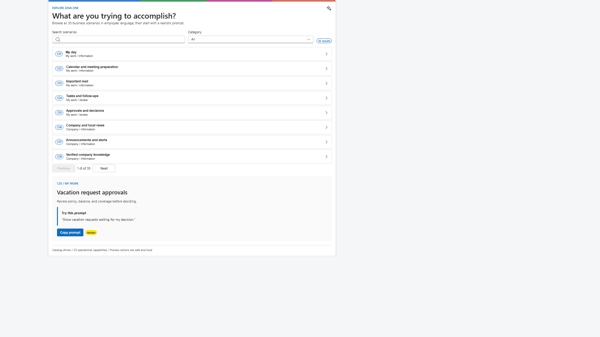

> **Current status:** the first-submission candidate is locally validated with 25 passing tests, 39
> settled experience screenshots, required gallery metadata, and a committed production SPPKG.
> Tenant-authenticated modern SharePoint/Teams chrome and complete host accessibility validation are
> still required. SPFx 1.24 beta.5 Copilot Components remain preview technology and are not presented
> as production-ready.

## Highlights

- **35 business capabilities**, each with one final-named SharePoint-only web part and one final-named
  Copilot Component generated through the SPFx Yeoman generator.
- **Three composed workspace web parts:** Zava One, Zava One Company, and Zava One Personal. Only these
  web parts are enabled for Teams personal and channel tabs.
- **One shared `ZavaOneWorkspace`** for SharePoint, Teams, and Copilot full screen. Company-only and
  Personal-only modes omit the top-level tab switcher.
- **C35 vacation approvals:** ranked queue, employee portraits, policy/balance/coverage evidence,
  decision review, explicit approval/decline, simulated receipt, updated queue, and deterministic reset.
- **Company newsroom:** eight substantial fictional Zava stories with named authors, bundled portraits,
  distinctive editorial photography, publication metadata, and six selectable layouts.
- **Decision-grade visualization:** focused D3 bar charts with exact-value tables and an offline Natural
  Earth office projection with equivalent marker/list selection.
- **Offline keynote reliability:** 28 provenance-checked media assets embedded once in the shared bundle;
  no runtime content or profile-photo request is required.
- **Copilot bridge behavior:** host-authoritative expansion, complete model-context snapshots, explicit
  user-triggered follow-ups, persistent React roots, and owner-document Fluent/Griffel rendering.

## Experience Gallery

Every capability has a settled local screenshot under
[`ux-review/evidence/all-experiences`](./ux-review/evidence/all-experiences). The generated inventory and
hashes are in
[`all-experiences-matrix.json`](./ux-review/evidence/all-experiences-matrix.json).

| ID | Experience | SharePoint web part | Copilot tool | Screenshot |
| --- | --- | --- | --- | --- |
| C01 | My day | MyDay | ShowMyDay | [View](./ux-review/evidence/all-experiences/c01-my-day.png) |
| C02 | Calendar and meeting preparation | Agenda | ShowMyAgenda | [View](./ux-review/evidence/all-experiences/c02-agenda.png) |
| C03 | Important mail | ImportantMail | ShowImportantMail | [View](./ux-review/evidence/all-experiences/c03-important-mail.png) |
| C04 | Tasks and follow-ups | Tasks | ShowMyTasks | [View](./ux-review/evidence/all-experiences/c04-tasks.png) |
| C05 | Approvals and decisions | Approvals | ShowMyApprovals | [View](./ux-review/evidence/all-experiences/c05-approvals.png) |
| C06 | Company and local news | CompanyNews | ShowCompanyNews | [View](./ux-review/evidence/all-experiences/c06-company-news.png) |
| C07 | Announcements and alerts | ActiveAnnouncements | ShowActiveAnnouncements | [View](./ux-review/evidence/all-experiences/c07-announcements.png) |
| C08 | Verified company knowledge | CompanyKnowledge | FindCompanyKnowledge | [View](./ux-review/evidence/all-experiences/c08-knowledge.png) |
| C09 | Apps and employee services | EmployeeServices | FindEmployeeService | [View](./ux-review/evidence/all-experiences/c09-employee-services.png) |
| C10 | Company events and town halls | CompanyEvents | ShowCompanyEvents | [View](./ux-review/evidence/all-experiences/c10-company-events.png) |
| C11 | People and expertise | People | FindPeople | [View](./ux-review/evidence/all-experiences/c11-people.png) |
| C12 | Onboarding and transitions | Onboarding | ShowMyOnboarding | [View](./ux-review/evidence/all-experiences/c12-onboarding.png) |
| C13 | Mandatory learning | Learning | ShowMyLearning | [View](./ux-review/evidence/all-experiences/c13-learning.png) |
| C14 | Praise and communities | RecognitionAndCommunities | ShowRecognitionAndCommunities | [View](./ux-review/evidence/all-experiences/c14-recognition.png) |
| C15 | Daily signals and surveys | EmployeeSurveys | ShowEmployeeSurveys | [View](./ux-review/evidence/all-experiences/c15-surveys.png) |
| C16 | Time off and holidays | TimeOff | ShowTimeOff | [View](./ux-review/evidence/all-experiences/c16-time-off.png) |
| C17 | Payslips and tax documents | PayDocuments | ShowPayDocuments | [View](./ux-review/evidence/all-experiences/c17-pay-documents.png) |
| C18 | Benefits and life events | Benefits | ShowMyBenefits | [View](./ux-review/evidence/all-experiences/c18-benefits.png) |
| C19 | Equity and vesting | Equity | ShowMyEquity | [View](./ux-review/evidence/all-experiences/c19-equity.png) |
| C20 | Expenses and travel | ExpensesAndTravel | ShowExpensesAndTravel | [View](./ux-review/evidence/all-experiences/c20-expenses-travel.png) |
| C21 | Cafeteria and campus food | CampusMenu | ShowCampusMenu | [View](./ux-review/evidence/all-experiences/c21-campus-menu.png) |
| C22 | Rooms and workplace booking | WorkplaceSpace | FindWorkplaceSpace | [View](./ux-review/evidence/all-experiences/c22-workplace-space.png) |
| C23 | IT support | ItHelp | GetITHelp | [View](./ux-review/evidence/all-experiences/c23-it-help.png) |
| C24 | Facilities and site services | WorkplaceHelp | GetWorkplaceHelp | [View](./ux-review/evidence/all-experiences/c24-workplace-help.png) |
| C25 | Shifts and attendance | Shifts | ShowMyShifts | [View](./ux-review/evidence/all-experiences/c25-shifts.png) |
| C26 | Project and portfolio health | ProjectHealth | ShowProjectHealth | [View](./ux-review/evidence/all-experiences/c26-project-health.png) |
| C27 | Sales performance | SalesPerformance | ShowSalesPerformance | [View](./ux-review/evidence/all-experiences/c27-sales-performance.png) |
| C28 | Company outcomes and goals | GoalsAndScorecards | ShowGoalsAndScorecards | [View](./ux-review/evidence/all-experiences/c28-goals-scorecards.png) |
| C29 | Recent files | WorkFiles | FindMyWorkFiles | [View](./ux-review/evidence/all-experiences/c29-work-files.png) |
| C30 | Team availability | TeamAvailability | ShowTeamAvailability | [View](./ux-review/evidence/all-experiences/c30-team-availability.png) |
| C31 | Company stock | CompanyStock | ShowCompanyStock | [View](./ux-review/evidence/all-experiences/c31-company-stock.png) |
| C32 | Corporate glossary | CorporateGlossary | FindCompanyTerm | [View](./ux-review/evidence/all-experiences/c32-glossary.png) |
| C33 | Report a security concern | SecurityReporting | ReportSecurityConcern | [View](./ux-review/evidence/all-experiences/c33-security-reporting.png) |
| C34 | Offices and world map | OfficeDetails | ShowOfficeDetails | [View](./ux-review/evidence/all-experiences/c34-office-details.png) |
| C35 | Vacation request approvals | VacationRequestApprovals | ReviewVacationRequests | [View](./ux-review/evidence/all-experiences/c35-vacation-approvals.png) |

### Publication Story

| Company workspace | Personal workspace |
| --- | --- |
| [](./assets/preview.png) | [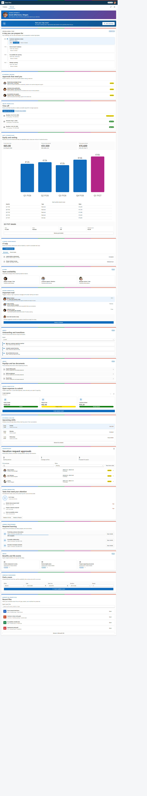](./assets/screenshot-personal.png) |

| Company News | Praise composer |
| --- | --- |
| [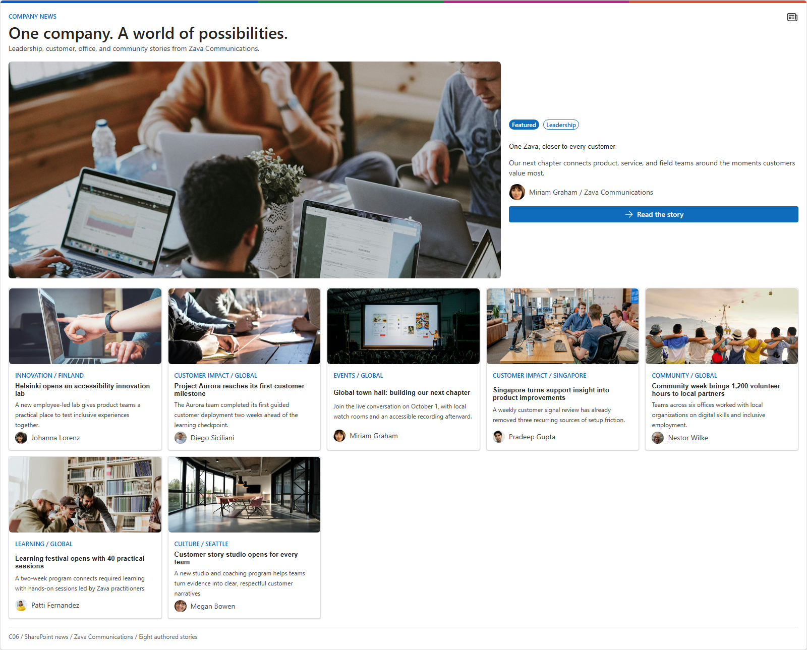](./assets/screenshot-company-news.png) | [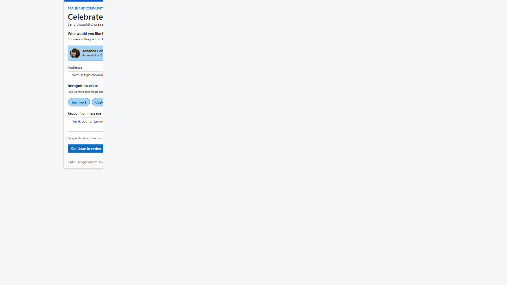](./assets/screenshot-recognition-compose.png) |

| Sales performance | Global offices |
| --- | --- |
| [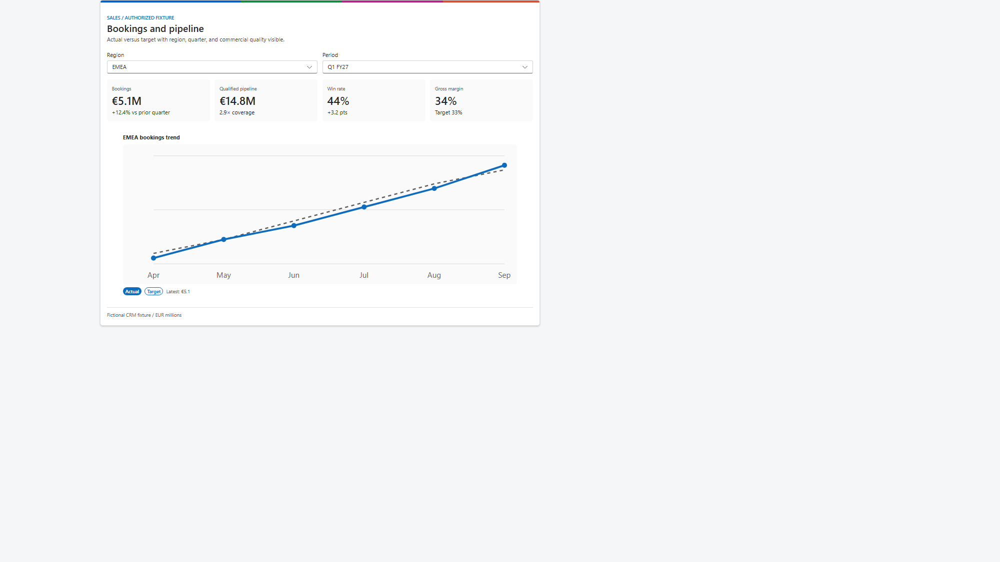](./assets/screenshot-sales-performance.png) | [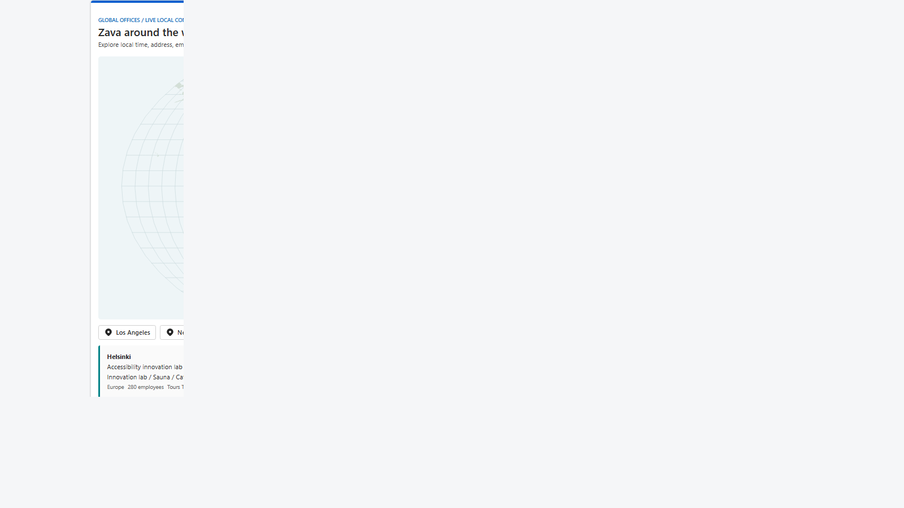](./assets/screenshot-office-map.png) |

#### Vacation Approval Flow

| Queue | Request detail |
| --- | --- |
| [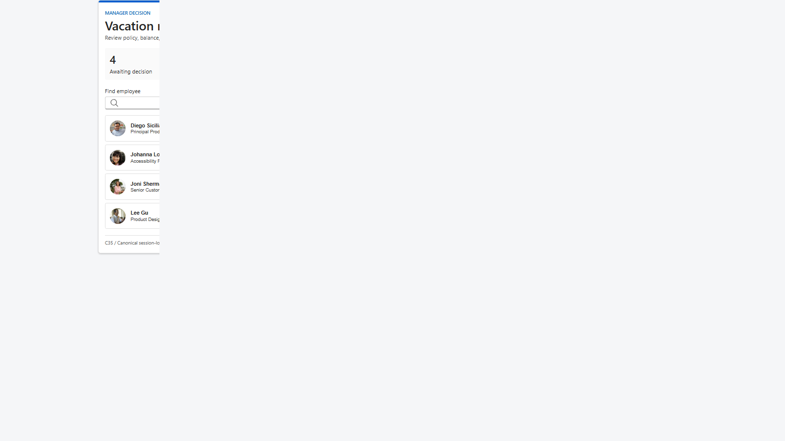](./assets/screenshot-vacation-approvals.png) | [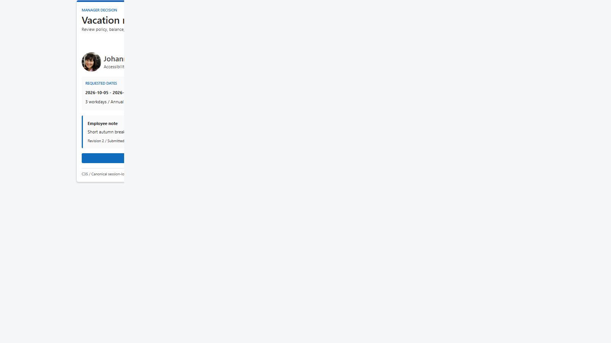](./assets/screenshot-vacation-detail.png) |

| Decision review | Simulated receipt |
| --- | --- |
| [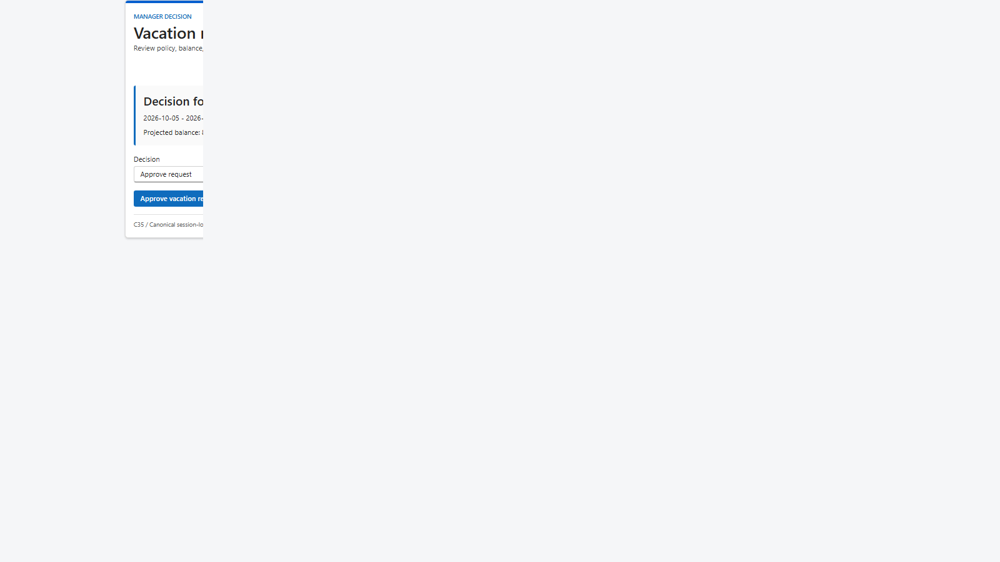](./assets/screenshot-vacation-decision.png) | [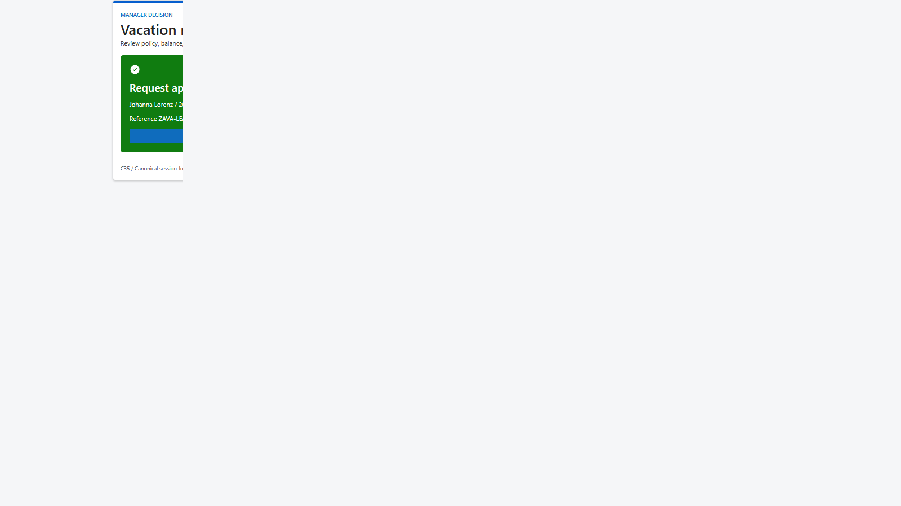](./assets/screenshot-vacation-receipt.png) |

| Updated queue | Capability explorer |
| --- | --- |
| [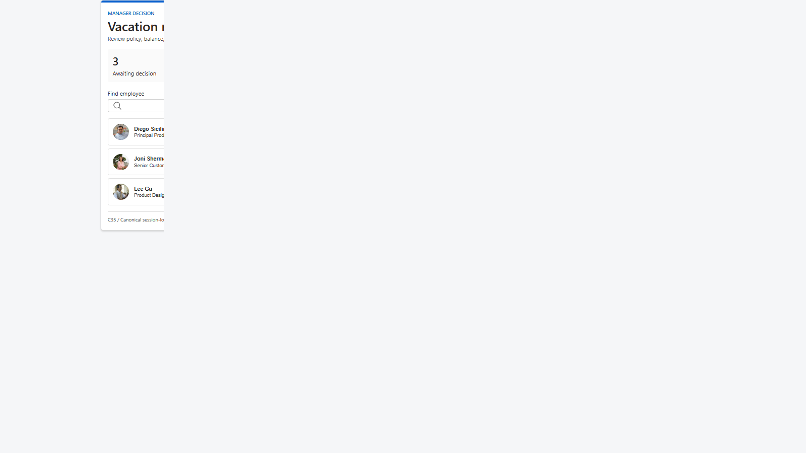](./assets/screenshot-vacation-updated-list.png) | [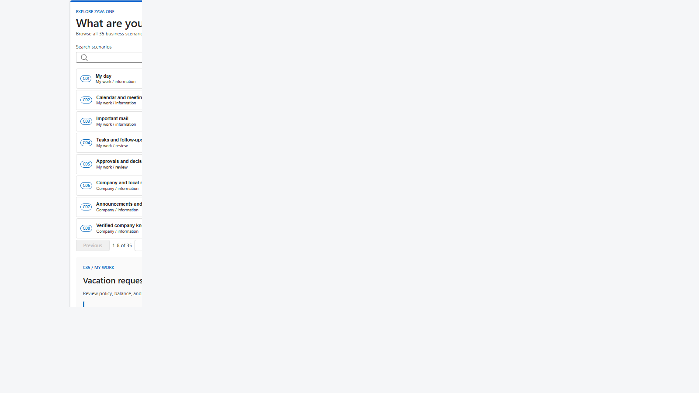](./assets/screenshot-capability-explorer.png) |

The ordered publication inventory and crop review are in
[`assets/publication-screenshots.md`](./assets/publication-screenshots.md). The four full workspace
states and all 35 focused experiences remain available in the engineering gallery above.

## Architecture

```text
35 SharePoint web parts        35 Copilot Components
        \                              /
         thin generated host adapters
                    |
       shared capability catalog + React experiences
                    |
       typed fixtures + evented session-local store
                    |
  ZavaOneWorkspace (combined / company / personal)
```

- `config/zava-capabilities.mjs` is the canonical identity, route, operation, prompt, and layout catalog.
- `scripts/configure-reference-hosts.mjs` regenerates thin wrappers, tool schemas/descriptions, host
  allowlists, package pins, and separate SharePoint-web-part and Copilot-Component bundles after Yeoman generation.
- `src/shared/` owns the React experiences, host adapters, typed fixtures, session store, media, and D3
  visualization primitives.
- Every feature web part is SharePoint-only. The three workspace web parts alone support
  `SharePointFullPage`, `TeamsPersonalApp`, and `TeamsTab`, allowing the composed workspaces to be used
  as locked SharePoint single-part app pages without exposing individual features as full-page apps.
- Copilot inline answers one focused question. Full screen renders the shared workspace at the owning
  route. Prompt values filter or prefill but never authorize or submit an operation.
- The Company tab is a full 17-experience portal by default. A pinned company-wide update hero surfaces
  current announcements and alerts, while the real shared Company components fill three independently
  stacked columns. Company has its own Edit layout, hide/restore, Personalize rail, and session-persisted
  order/visibility settings, isolated from the Personal portal.
- Company Events, People, Daily Poll, Campus Menu, Project Health, Sales, Goals, Stock, and Offices use
  purpose-built calendar, profile/chat, poll, photographed menu, portfolio, chart, scorecard, market, and
  concierge-map experiences. Recognition uses verified Fluent token contrast in light and dark themes.
- My Day follows the adjacent PnP My Day interaction model: a private greeting, glanceable meeting,
  task, mail, learning, and company signals, inline drill-down, and a full-screen Personal dashboard
  with Plan My Day and panel settings. Agenda is a time rail, Glossary is governed term discovery, and
  Security Reporting is a confidential choose-describe-review flow. Remaining capabilities use
  grammar-specific controls and layouts instead of a universal scope/search/list template.
- All 18 Personal Copilot components expose the same top-right **Expand** action. The label is visible
  when space allows and collapses to a 32px icon-only button below 520px. Every Personal expansion opens
  the same 18-module Personal portal, without duplicating the invoking component. Plan My Day and
  Personalize use animated right-side panels; Personalize controls module visibility for the session.
  The Personal bar exposes **Edit layout | Personalize** with edit/settings icons; the hero has no duplicate
  settings action or component-count label. Plan My Day and Personalize use the My Day-style 380px sibling
  rail: no modal backdrop, a 250ms slide-in, and the dashboard remains visible and interactive. Planning
  waits 800ms while prioritizing, then reveals one recommendation every 220ms. Edit mode reveals accessible move handles and a hide action for
  the 17 experience panels; normal mode shows neither control. Pointer or keyboard moves persist the
  three-column order for the session. Hiding a panel immediately updates Personalize, where it can be restored.
- Personal Tasks, Important Mail, and Required Learning reuse the same interactive bodies in their
  standalone component, My Day drill-down, and full-screen dashboard: checkbox progress, sender faces
  with Outlook review, and assignment progress/actions remain consistent. Approvals, Time Off, Expenses,
  Workplace Space, and IT Help use explicit review/confirm/receipt flows with session-local queue updates.
  Equity separates received values from its D3 estimate, Work Files adds search and branded file types,
  and Agenda keeps Expand in the top-right with Outlook review on every meeting.
- Inline Copilot workflows explicitly synchronize their intrinsic rendered height with the host after
  state changes and animations, so longer forms grow and returning to shorter summaries shrinks the canvas.

## Publisher Configuration

Every C01-C35 web part has a catalog-owned authoring profile with domain-specific defaults. High-use
choices such as layout, view, period, scope, status, category, or location are available as SharePoint
Top Action dropdowns while the page is in edit mode. An **Advanced settings** Top Action opens the
property pane for the title, item limit, density, source/freshness visibility, image visibility, and
safe demo-action policy when those settings apply to that feature.

Company News offers Editorial, Hero tiles, Layers, Carousel, Filmstrip, and Compact list as complete
page compositions. Layout is configured only through its SharePoint Top Action or property pane; the
published web part does not render a duplicate layout selector inside the experience.

The Combined, Company, and Personal workspace web parts are available in SharePoint's single-part app
page picker. Existing pages can be converted with PnP PowerShell using
`Set-PnPPage -Identity "Page" -LayoutType SingleWebPartAppPage` after adding the selected workspace.

The combined workspace can choose its Company or Personal start tab; fixed Company and Personal
workspaces deliberately omit that setting. Top Actions use `@microsoft/sp-top-actions@1.24.0-beta.5`
and require a live modern SharePoint page for host-level verification because they do not render in
the hosted Workbench. Copilot Components bypass this publisher configuration entirely and continue to
accept only intent-specific tool parameters.

## Demo Data and Safety

All runtime business data is fictional and deterministic. Confirmed demo actions update an evented,
session-local store and clearly identify simulated receipts; they never call an external provider.
Sensitive drafts are not placed in URLs or model context. C35 demonstrates the complete state story:
list, detail, decision, receipt, updated queue, cross-surface status, and reset.

Persona and editorial media provenance, source URLs, usage notes, dimensions, and hashes are recorded in
[`assets/media-provenance.json`](./assets/media-provenance.json). Runtime media is generated into one
embedded module so keynote rendering remains offline.

## Validation Snapshot

| Check | Phase 6 result |
| --- | --- |
| SPFx components | 75 unique GUIDs |
| Business capabilities | 35 web-part/Copilot pairs |
| Copilot plugin | v2.4, 37 validated functions / 6 conversation starters |
| Agent branding | Zava One / 192px color icon / 32px transparent outline icon |
| SPFx bundles | 2 host-specific bundles with shared source |
| Tests | 25 passed / 0 failed |
| Inline visual smoke | 35 rendered / 35 unique layouts / 0 runtime, overflow, or image failures |
| Copilot Workbench | 37/37 Ready baseline; 8/8 changed Personal workflows revalidated |
| Complete screenshot gallery | 39 PNGs |
| Bundled media | 28 provenance-checked assets |
| Production package | `6,357,899` bytes / 169 entries |
| Publication gallery | `assets/sample.json` / 12 reviewed 1600x900 PNGs |

See [`phase-6-matrix.json`](./ux-review/evidence/phase-6-matrix.json),
[`g0-bootstrap.md`](./ux-review/evidence/g0-bootstrap.md), and
[`todo.md`](./todo.md) for detailed evidence and remaining gates.

## Testing and Deployment Readiness

| Gate | Status | Next action |
| --- | --- | --- |
| Source, generated hosts, media, and routing validation | Ready | Run `npm ci` and `npm run validate` |
| Local visual review | Ready | Run the UX review harness and use the documented query parameters |
| SharePoint solution package | Ready to deploy to a developer tenant | Upload the committed SPPKG to an approved app catalog |
| Copilot Component baseline | Ready for tenant verification | Confirm all six starters and 37 tools in Copilot Workbench |
| Modern SharePoint pages and Teams tabs | External validation required | Verify Top Actions, responsive chrome, focus, and CSP after deployment |
| Production use | Not claimed | Replace fixtures and complete security, privacy, accessibility, and service-owner reviews |

## Demo and Sharing Package

| Guide | Use |
| --- | --- |
| [Demo index](./demos/README.md) | Preflight and recommended order |
| [90-second keynote](./demos/keynote-90-seconds.md) | Timed prompts, routes, checkpoints, and fallback |
| [Business journey](./demos/business-journey.md) | Company, Personal, review, submit preview, charts, and map |
| [Technical walkthrough](./demos/technical-walkthrough.md) | Architecture, host isolation, state, routing, and evidence |
| [Demo operations](./demos/demo-operations.md) | Reset, offline fallback, and failure recovery |
| [Release readiness](./docs/release-readiness.md) | Host matrix, privacy, accessibility, validation, and external gates |

## Minimal Path to Awesome

### Deploy the committed package

1. Upload [`sharepoint/solution/zava-one-hub.sppkg`](./sharepoint/solution/zava-one-hub.sppkg) to an
   approved SharePoint App Catalog in a developer/test tenant.
2. Enable the solution for the intended test scope.
3. Add a Zava One feature web part to a SharePoint page, or use one of the three composed workspace web
   parts for SharePoint/Teams testing.
4. Add the generated Zava One agent to Microsoft 365 Copilot and test inline/full-screen routing.

### Build from source

Prerequisites:

- Node.js `>=22.14.0 <23.0.0`
- npm and the repository lockfile
- Yeoman `5.1.0` plus `@microsoft/generator-sharepoint@1.24.0-beta.5` only when generating components

```bash
npm ci
npm run validate
npm run build
```

`npm run build` validates generated hosts, media, visual evidence, tests, the generated API plugin, and
the final `.sppkg`.

### Review without a tenant

```bash
npm run build:ux-review
npm run start:ux-review
```

Open `http://127.0.0.1:4322`. Query parameters select an experience:

```text
?intent=companyNews&surface=copilotInline&theme=light
?intent=vacationApprovals&surface=copilotInline&theme=dark
?intent=workspace&surface=workspace&mode=combined&theme=light
?intent=workspace&surface=workspace&mode=company&theme=light
?intent=workspace&surface=workspace&mode=personal&theme=light
```

## Current Limitations

- Tenant-authenticated SharePoint, Teams, and Copilot Workbench checks are still blocked on an approved
  tenant/app catalog and test accounts.
- The current providers are fixtures. Live Graph, SharePoint, HR, LMS, ITSM, CRM, finance, market,
  workplace, and security integrations are deferred.
- Phase 7 final motion, per-intent edge-state expansion, localization/RTL,
  forced-color, and screen-reader host testing remain open in `todo.md`.
- VS Code may show inherited TypeScript 6 deprecation warnings for the generator-owned ES5/node10 base
  config. The pinned TypeScript 5.8/Heft build is clean; changing the generated target is intentionally
  deferred until the SPFx baseline changes.

## Solution

| Solution | Author |
| --- | --- |
| Zava One | Vesa Juvonen (Microsoft) |

## Version History

| Version | Date | Comments |
| --- | --- | --- |
| 1.0.0 | September 30, 2026 | Sharing candidate with 35 paired capabilities, demo scripts, and complete publication gallery |

## References

- [SharePoint Framework overview](https://learn.microsoft.com/sharepoint/dev/spfx/sharepoint-framework-overview)
- [Build your first SharePoint Copilot App](https://learn.microsoft.com/sharepoint/dev/spfx/copilot/get-started/build-your-first-copilot-app)
- [Expose SharePoint Framework web parts in Microsoft Teams](https://learn.microsoft.com/sharepoint/dev/spfx/build-for-teams-expose-webparts-teams)
- [Heft-based SPFx toolchain](https://learn.microsoft.com/sharepoint/dev/spfx/toolchain/sharepoint-framework-toolchain-rushstack-heft)
- [Microsoft 365 & Power Platform Community](https://aka.ms/community/home)

## Disclaimer

**THIS CODE IS PROVIDED _AS IS_ WITHOUT WARRANTY OF ANY KIND, EITHER EXPRESS OR IMPLIED, INCLUDING ANY
IMPLIED WARRANTIES OF MERCHANTABILITY, FITNESS FOR A PARTICULAR PURPOSE, OR NON-INFRINGEMENT.**

