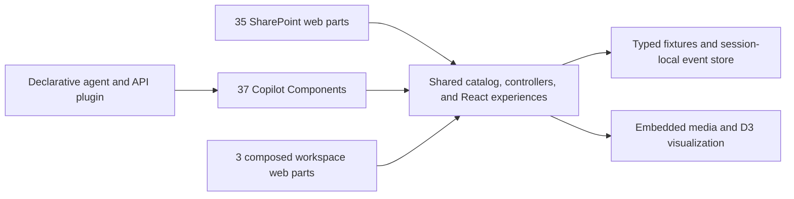
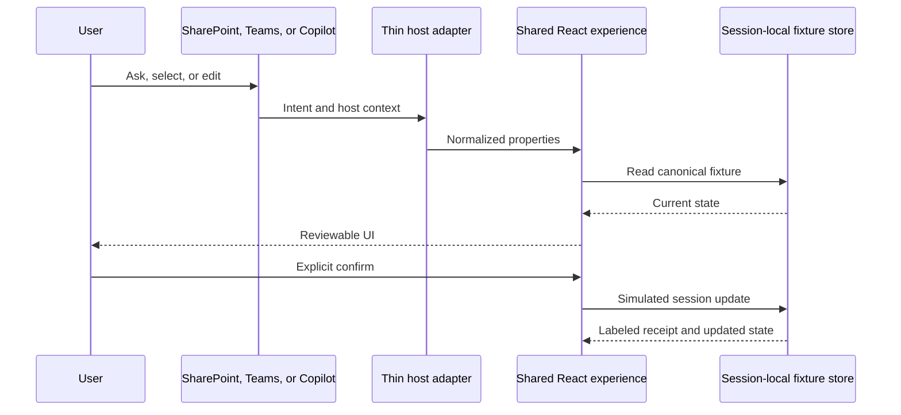

# Release readiness

This document is the concise sharing and validation handoff for the fixture-first Zava One sample.

## Architecture



## Data and action flow



## Host matrix

| Surface | Count | Exposure | Validation state |
| --- | ---: | --- | --- |
| Feature web parts | 35 | `SharePointWebPart` only | Package and hosted Workbench baseline validated |
| Workspace web parts | 3 | SharePoint web part/full page, Teams personal app/tab | Package validated; authenticated Teams chrome pending |
| Feature Copilot Components | 35 | Inline and full screen | Generated plugin and Workbench baseline validated |
| Workspace Copilot Component | 1 | Composed full-screen workspace | Generated plugin validated |
| Capability explorer | 1 | Isolated discovery experience | Generated plugin validated |

## Privacy and safety

- Business data, people, prices, policies, and receipts are fictional fixtures.
- No runtime Graph, SharePoint, HR, finance, CRM, LMS, ITSM, market, or security provider is called.
- Drafts remain local to the invocation; confirmed demo changes remain in the browser session.
- Sensitive drafts are not placed in URLs or model-visible context.
- Every simulated mutation requires review and explicit confirmation.
- A simulated receipt is not evidence of a source-system write.

## Accessibility evidence and limits

Locally validated behavior includes semantic controls, visible focus, keyboard-capable layout movement,
text alternatives for charts/maps, light/dark token use, and responsive component layouts. Publication
screenshots were reviewed as complete full-page/full-workspace captures with at least 1600px width.

This is not an accessibility certification. Authenticated host testing remains required for Narrator or
JAWS, 200% zoom, forced colors, reduced motion, iframe focus, Teams chrome, and modern SharePoint page
integration.

## Local validation

Run with Node.js `>=22.14.0 <23.0.0`:

```bash
npm ci
npm run validate
npm run build
git diff --check
```

Stop `npm start` before a clean build. The current evidence records:

- 25 tests passed, zero failed;
- 35 capability pairs and 75 unique SPFx component GUIDs;
- 37 unique generated plugin functions and six conversation starters;
- two host-specific bundles and 28 provenance-checked media assets;
- 39 complete experience screenshots and 12 publication screenshots;
- a validated 169-entry SPPKG.

Artifact hashes and measured sizes are authoritative in
[`phase-6-matrix.json`](../ux-review/evidence/phase-6-matrix.json).

## Sharing checklist

- Use the committed SPPKG in `sharepoint/solution/zava-one-hub.sppkg`.
- Use the committed agent package in `teams/zava-one.zip`.
- Start with [`demos/README.md`](../demos/README.md).
- Use [`assets/sample.json`](../assets/sample.json) for gallery metadata.
- Keep tenant-host and production gates visible in the README and TODO.

## External gates

Before any production claim, validate authenticated SharePoint pages, Teams personal/channel tabs,
Copilot inline/full screen, CSP, focus transfer, screen readers, service permissions, privacy, retention,
telemetry, rollback, and support ownership.